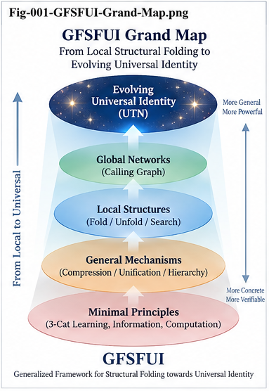
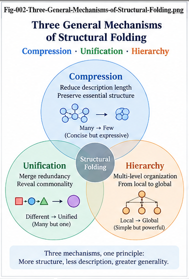
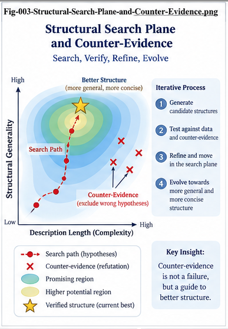
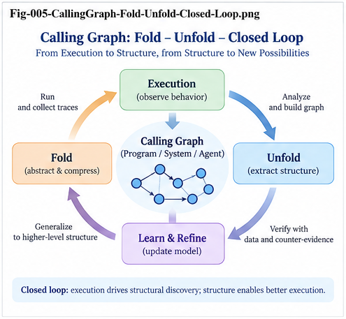

# FIGURE INDEX — GFSFUI

**General Framework of Structural Folding and Unfolding Intelligence**

This file defines the canonical figure set for the GFSFUI repository and provides recommended placement guidance for the seven core papers.

---

## 1. Figure Set Overview

The canonical GFSFUI figure set contains seven figures:

```text id="figidx01"
Fig-001 — GFSFUI Grand Map

Fig-002 — Three General Mechanisms of Structural Folding

Fig-003 — Structural Search Plane and Counter-Evidence

Fig-004 — 3-Cat Learning and Local Structural Growth

Fig-005 — CallingGraph Fold–Unfold Closed Loop

Fig-006 — Local UTN to Evolving Universal Identity

Fig-007 — Three Canonical Demonstrations and DOI Triangle
```

The figure sequence mirrors the conceptual progression of the seven core papers:

```text id="figidx02"
Framework
   ↓
Folding
   ↓
Search / Falsification
   ↓
Sparse Learning
   ↓
Unfolding
   ↓
Identity / UTN
   ↓
Demonstrations / Roadmap
```

---

# 2. Canonical Figure Files

```text id="figidx03"
figures/
├── Fig-001-GFSFUI-Grand-Map.png
├── Fig-002-Three-General-Mechanisms-of-Structural-Folding.png
├── Fig-003-Structural-Search-Plane-and-Counter-Evidence.png
├── Fig-004-3-Cat-Learning-and-Local-Structural-Growth.png
├── Fig-005-CallingGraph-Fold-Unfold-Closed-Loop.png
├── Fig-006-Local-UTN-to-Evolving-Universal-Identity.png
└── Fig-007-Three-Canonical-Demonstrations-and-DOI-Triangle.png
```

---

# 3. Figure-to-Paper Mapping

| Figure  | Primary Paper | Secondary Placement       |
| ------- | ------------- | ------------------------- |
| Fig-001 | GFSFUI-001    | README.md / START-HERE.md |
| Fig-002 | GFSFUI-002    | GFSFUI-001                |
| Fig-003 | GFSFUI-003    | GFSFUI-001 / GFSFUI-004   |
| Fig-004 | GFSFUI-004    | GFSFUI-003                |
| Fig-005 | GFSFUI-005    | GFSFUI-001 / GFSFUI-007   |
| Fig-006 | GFSFUI-006    | GFSFUI-005                |
| Fig-007 | GFSFUI-007    | README.md                 |

---

# 4. Fig-001 — GFSFUI Grand Map

**File**

`figures/Fig-001-GFSFUI-Grand-Map.png`

**Primary Paper**

`GFSFUI-001-General-Framework-of-Structural-Folding-and-Unfolding-Intelligence.md`

**Primary Purpose**

Provide a one-page visual overview of the entire GFSFUI framework.

The figure should help readers see the progression from:

```text id="figidx04"
Local / Concrete Structure
        ↓
Structural Folding
        ↓
Reusable Structural Memory
        ↓
Search / Growth
        ↓
Unfolding
        ↓
Broader Structural Intelligence
```

**Recommended Insertion Position**

Insert in **GFSFUI-001** after the introductory framework definition and canonical lifecycle, before the detailed mechanism sections.

A good placement is immediately after the section that introduces:

> **Represent → Fold → Localize → Search → Specialize → Unfold → Validate → Grow → Refold**

This allows the reader to see the entire framework before reading its components.

**Recommended Markdown**

```md


*Fig-001 — GFSFUI Grand Map. A high-level view of the General Framework of Structural Folding and Unfolding Intelligence, connecting structural representation, Folding, localized intelligence, search, Unfolding, validation, and continual structural growth.*
```

**Recommended Secondary Placements**

* `README.md`
* `START-HERE.md`

Use it as the canonical overview image.

---

# 5. Fig-002 — Three General Mechanisms of Structural Folding

**File**

`figures/Fig-002-Three-General-Mechanisms-of-Structural-Folding.png`

**Primary Paper**

`GFSFUI-002-Generic-Structural-Folding-from-Individuals-to-Structural-Memory.md`

**Primary Purpose**

Visualize the three main mechanisms underlying Generic Structural Folding:

```text id="figidx05"
Generic Structural Representation
        +
Generic Structural Folding
        +
Generic Per-Node Intelligence
```

The figure should reinforce that GFSFUI separates:

* representation,
* structural organization,
* and local intelligence.

**Recommended Insertion Position**

Insert in **GFSFUI-002** immediately after:

> `# 3. The Three General Mechanisms`

and before the detailed section on:

> `General Mechanism I — Generic Structural Representation`

This is the strongest placement because the reader first sees the three-part architecture, then reads each mechanism separately.

**Recommended Markdown**

```md


*Fig-002 — Three General Mechanisms of Structural Folding. Generic structural representation creates comparable individuals, Generic Structural Folding extracts reusable shared structure and localized difference, and Per-Node Intelligence attaches specialized intelligence to structural locations.*
```

**Recommended Secondary Placement**

Optional insertion in `GFSFUI-001` after the section introducing the three general mechanisms.

---

# 6. Fig-003 — Structural Search Plane and Counter-Evidence

**File**

`figures/Fig-003-Structural-Search-Plane-and-Counter-Evidence.png`

**Primary Paper**

`GFSFUI-003-Structural-Search-Counter-Evidence-and-Continual-Structural-Growth.md`

**Primary Purpose**

Show how Structural Search extends beyond raw data and how counter-evidence changes search from simple retrieval into a mechanism for structural refinement.

The figure should communicate:

```text id="figidx06"
Structural Search
      ↓
Support
      +
Counter-Evidence
      ↓
Difference
      ↓
Better Structure
```

It represents search as:

* retrieval,
* verification,
* discovery,
* and growth.

**Recommended Insertion Position**

Insert in **GFSFUI-003** after:

> `# 3. The Structural Search Plane`

or after:

> `# 4. Four Roles of Structural Search`

Either is appropriate, but placement immediately after the Structural Search Plane section is preferred.

**Recommended Markdown**

```md


*Fig-003 — Structural Search Plane and Counter-Evidence. Structural Search moves across Folded representations and explicitly searches both supporting and contradicting evidence. Counter-evidence is treated as a source of Delta and better structure rather than only as a score penalty.*
```

**Recommended Secondary Placements**

* `GFSFUI-001` near the Structural Search section
* `GFSFUI-004` near the sparse-data counter-evidence discussion

---

# 7. Fig-004 — 3-Cat Learning and Local Structural Growth

**File**

`figures/Fig-004-3-Cat-Learning-and-Local-Structural-Growth.png`

**Primary Paper**

`GFSFUI-004-Sparse-Data-Intelligence-and-3-Cat-Structural-Learning.md`

**Primary Purpose**

Visualize the transition from a few high-information examples to a Candidate Fold and then toward local structural growth.

The canonical idea is:

```text id="figidx07"
Few Examples
     ↓
Candidate Fold
     ↓
Prediction / Search
     ↓
Counter-Evidence
     ↓
Delta
     ↓
Local Growth
```

The figure should make clear that “3-Cat” is a structural-learning metaphor, not a claim that three samples prove a concept.

**Recommended Insertion Position**

Insert in **GFSFUI-004** after:

> `# 4. Candidate Fold`

or after:

> `# 8. Ask the Structural Universe`

The preferred location is after the Candidate Fold section, so the figure establishes the full sparse-learning lifecycle early.

**Recommended Markdown**

```md


*Fig-004 — 3-Cat Learning and Local Structural Growth. A small number of high-information examples can initiate a Candidate Fold, which is then searched, challenged, refined, and expanded through persistent Delta and localized structural growth.*
```

**Recommended Secondary Placement**

Optional insertion in `GFSFUI-003` near the sections on Candidate Delta and continual growth.

---

# 8. Fig-005 — CallingGraph Fold–Unfold Closed Loop

**File**

`figures/Fig-005-CallingGraph-Fold-Unfold-Closed-Loop.png`

**Primary Paper**

`GFSFUI-005-From-Folded-Experience-to-CallingGraph-Unfolding.md`

**Primary Purpose**

Visualize the complete CallingGraph lifecycle:

```text id="figidx08"
Program Experience
      ↓
CallingGraph
      ↓
Fold
      ↓
Structural Memory
      ↓
Unfold
      ↓
Candidate Program Structure
      ↓
Execution / Validation
      ↓
Learning / Refold
```

This figure represents the canonical full Fold–Unfold closed loop.

**Recommended Insertion Position**

Insert in **GFSFUI-005** after:

> `# 3. The Central Recursive Relationship`

This is the strongest location because the paper introduces the recursive relation early and the figure makes it immediately concrete.

A second possible placement is after:

> `# 50. The Fold–Unfold Closed Loop`

but this is less useful pedagogically because the reader sees the main figure too late.

**Recommended Markdown**

```md


*Fig-005 — CallingGraph Fold–Unfold Closed Loop. Certified program experience is Folded into reusable CallingGraph structural memory, searched and Unfolded toward new goals, validated through execution and counter-evidence, and returned as new structural experience through Refolding.*
```

**Recommended Secondary Placements**

* `GFSFUI-001` near the CallingGraph section
* `GFSFUI-007` in the CallingGraph canonical demonstration

---

# 9. Fig-006 — Local UTN to Evolving Universal Identity

**File**

`figures/Fig-006-Local-UTN-to-Evolving-Universal-Identity.png`

**Primary Paper**

`GFSFUI-006-Local-UTN-Context-Preserving-Unification-and-Fold-Unfold-Identity.md`

**Primary Purpose**

Show how identity can evolve progressively from local context toward broader structural unification without requiring global naming in advance.

The canonical progression is:

```text id="figidx09"
Local Identity
      ↓
Local UTN
      ↓
Structural Comparison
      ↓
Candidate Equivalence
      ↓
Integrated / Certified Identity
      ↓
Evolving Universal Identity
```

The figure emphasizes:

> **Localize first. Universalize progressively.**

**Recommended Insertion Position**

Insert in **GFSFUI-006** after:

> `# 13. Local UTN`

or after:

> `# 27. A Progressive UTN Ladder`

The preferred location is after the progressive UTN ladder because the visual directly reinforces the level-by-level identity evolution.

**Recommended Markdown**

```md


*Fig-006 — Local UTN to Evolving Universal Identity. Local identities are preserved and normalized first, then progressively compared, integrated, challenged, and promoted toward broader structural identities through Fold-Guided UTN Evolution.*
```

**Recommended Secondary Placement**

Optional insertion in `GFSFUI-005` near the Local UTN discussion.

---

# 10. Fig-007 — Three Canonical Demonstrations and DOI Triangle

**File**

`figures/Fig-007-Three-Canonical-Demonstrations-and-DOI-Triangle.png`

**Primary Paper**

`GFSFUI-007-Three-Canonical-Demonstrations-and-Research-Roadmap.md`

**Primary Purpose**

Summarize the three canonical demonstrations and the three-repository research front.

The figure should connect:

```text id="figidx10"
Stock
   ↓
Structural Folding

Biomedical
   ↓
Structural Search / Falsification / Growth

CallingGraph
   ↓
Structural Unfolding / Generation
```

and:

```text id="figidx11"
                 GFSFUI
            General Framework
               /       \
              /         \
           SMSF ─────── CSFR
```

**Recommended Insertion Position**

Insert in **GFSFUI-007** after:

> `# 42. The Three Demonstrations Together`

or immediately before:

> `# 47. The Three-DOI Structural Folding Front`

The preferred placement is between these two sections.

This allows the first half of the figure to summarize the three demonstrations and the second half to introduce the DOI triangle.

**Recommended Markdown**

```md


*Fig-007 — Three Canonical Demonstrations and DOI Triangle. Stock demonstrates Structural Folding, Biomedical demonstrates Structural Search, Falsification, and Growth, and CallingGraph demonstrates Structural Unfolding and Generation. SMSF, CSFR, and GFSFUI form a complementary research triangle of concrete application, reusable mechanism, and general framework.*
```

**Recommended Secondary Placement**

`README.md`, near the section:

> `The Three-DOI Structural Folding Front`

---

# 11. Recommended One-Figure-Per-Core-Paper Mapping

For the cleanest repository presentation, use one primary figure in each core paper:

```text id="figidx12"
GFSFUI-001 → Fig-001
GFSFUI-002 → Fig-002
GFSFUI-003 → Fig-003
GFSFUI-004 → Fig-004
GFSFUI-005 → Fig-005
GFSFUI-006 → Fig-006
GFSFUI-007 → Fig-007
```

This creates a strong visual correspondence between paper numbering and figure numbering.

---

# 12. Recommended Figure Reading Sequence

The figures themselves can be read as a compressed version of the entire repository.

```text id="figidx13"
Fig-001
Grand Framework
   ↓
Fig-002
How Folding Works
   ↓
Fig-003
How Structure Is Searched and Challenged
   ↓
Fig-004
How Sparse Evidence Produces Growth
   ↓
Fig-005
How Structural Memory Is Unfolded
   ↓
Fig-006
How Identity Evolves Across Contexts
   ↓
Fig-007
How the Three Demonstrations and DOI Front Fit Together
```

A reader who understands the seven figures should already have a strong conceptual map of GFSFUI.

---

# 13. Recommended README Figure Usage

For a text-first README, two figures are sufficient.

## Primary README Figure

Use:

`Fig-001-GFSFUI-Grand-Map.png`

near the top of the README after the one-paragraph definition.

## Secondary README Figure

Use:

`Fig-007-Three-Canonical-Demonstrations-and-DOI-Triangle.png`

near the sections discussing:

* the three canonical demonstrations;
* SMSF;
* CSFR;
* GFSFUI.

This keeps the README visually strong without making it image-heavy.

---

# 14. Recommended START-HERE Figure Usage

Use only one figure in `START-HERE.md`:

> `Fig-001-GFSFUI-Grand-Map.png`

The goal of START-HERE is speed.

Readers should not need to scroll through seven figures before entering the core papers.

---

# 15. Canonical Figure Captions

For consistency, the recommended short captions are:

### Fig-001

> **GFSFUI Grand Map — From concrete experience through Structural Folding, Search, Unfolding, Validation, and continual growth.**

### Fig-002

> **Three General Mechanisms — Generic Structural Representation, Generic Structural Folding, and Generic Per-Node Intelligence.**

### Fig-003

> **Structural Search Plane — Search for both supporting evidence and counter-evidence to refine Folded structure.**

### Fig-004

> **3-Cat Structural Learning — Few examples can initiate a Candidate Fold that grows through search, Delta, and local validation.**

### Fig-005

> **CallingGraph Fold–Unfold Closed Loop — Certified program experience becomes reusable structural memory for future generation and Refolding.**

### Fig-006

> **Local UTN to Evolving Universal Identity — Local identities become progressively comparable, unified, validated, and promotable.**

### Fig-007

> **Three Canonical Demonstrations and DOI Triangle — Stock, Biomedical, and CallingGraph demonstrate Folding, Learning, and Unfolding across the SMSF–CSFR–GFSFUI research front.**

---

# 16. Figure Design Semantics

The seven figures should consistently communicate the following semantic progression:

```text id="figidx14"
Many Concrete Forms
        ↓
Reusable Structure
        ↓
Searchable Structure
        ↓
Self-Critical Structure
        ↓
Growing Structure
        ↓
Generative Structure
        ↓
Cross-Context Structure
```

This sequence is more important than any one visual style.

---

# 17. Figure Numbering Policy

The canonical figure numbering is:

```text id="figidx15"
Fig-001
Fig-002
Fig-003
Fig-004
Fig-005
Fig-006
Fig-007
```

This numbering should remain stable across:

* GitHub,
* Zenodo,
* ResearchGate,
* release notes,
* derivative PDFs,
* and future citations.

Do not renumber figures based on article placement.

The figure number represents the canonical repository-level figure identity.

---

# 18. Figure File Naming Policy

Use exact descriptive filenames:

```text id="figidx16"
Fig-001-GFSFUI-Grand-Map.png

Fig-002-Three-General-Mechanisms-of-Structural-Folding.png

Fig-003-Structural-Search-Plane-and-Counter-Evidence.png

Fig-004-3-Cat-Learning-and-Local-Structural-Growth.png

Fig-005-CallingGraph-Fold-Unfold-Closed-Loop.png

Fig-006-Local-UTN-to-Evolving-Universal-Identity.png

Fig-007-Three-Canonical-Demonstrations-and-DOI-Triangle.png
```

Avoid alternate abbreviations unless a derivative image requires them.

---

# 19. Recommended Article Placement Summary

| Paper      | Figure  | Recommended Placement                                                            |
| ---------- | ------- | -------------------------------------------------------------------------------- |
| GFSFUI-001 | Fig-001 | After framework lifecycle introduction                                           |
| GFSFUI-002 | Fig-002 | After “The Three General Mechanisms”                                             |
| GFSFUI-003 | Fig-003 | After “The Structural Search Plane”                                              |
| GFSFUI-004 | Fig-004 | After “Candidate Fold”                                                           |
| GFSFUI-005 | Fig-005 | After “The Central Recursive Relationship”                                       |
| GFSFUI-006 | Fig-006 | After “A Progressive UTN Ladder”                                                 |
| GFSFUI-007 | Fig-007 | Between “Three Demonstrations Together” and “Three-DOI Structural Folding Front” |

---

# 20. Canonical Figure Logic

The seven figures form a single conceptual narrative:

```text id="figidx17"
Fig-001
What is the whole framework?

Fig-002
How does experience Fold?

Fig-003
How does the system search and challenge what it Folded?

Fig-004
How can sparse evidence initiate learning and local growth?

Fig-005
How can Folded structural memory be Unfolded toward new goals?

Fig-006
How can local identities become reusable across contexts?

Fig-007
How do the demonstrations and research repositories fit together?
```

This is the intended visual learning path.

---

# 21. Final Figure Map

```text id="figidx18"
                            Fig-001
                        GFSFUI Grand Map
                              │
          ┌───────────────────┼───────────────────┐
          │                   │                   │
          ▼                   ▼                   ▼
       Fig-002             Fig-003             Fig-005
       Folding              Search              Unfold
          │                   │                   │
          │                   ▼                   │
          │                Fig-004                │
          │             Sparse Growth             │
          │                                       │
          └───────────────────┬───────────────────┘
                              ▼
                           Fig-006
                     Identity / Local UTN
                              │
                              ▼
                           Fig-007
                Demonstrations + DOI Triangle
```

The repository therefore moves visually from:

> **Framework → Folding → Search → Growth → Unfolding → Identity → Research Synthesis**

---

# 22. Canonical Closing Statement

The seven figures should collectively reinforce the core GFSFUI thesis:

> **Fold experience into structure. Search where the structure holds and where it fails. Unfold structural memory toward new goals. Validate the result, and fold the new experience back into a growing intelligence.**

---

**GFSFUI — Figure Index**
**General Framework of Structural Folding and Unfolding Intelligence**
