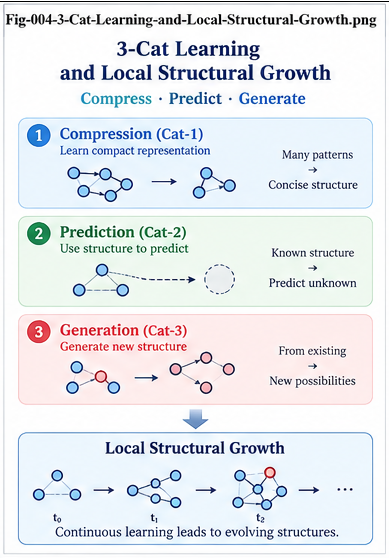

# GFSFUI-004 — Sparse-Data Intelligence and 3-Cat Structural Learning

**GFSFUI Series — General Framework of Structural Folding and Unfolding Intelligence**

**Document ID:** GFSFUI-004
**Status:** Core Framework Paper
**Version:** v1.0
**Language:** English

---

## Abstract

Intelligence often begins before large datasets exist.

A child may encounter only a few cats before forming a provisional concept of “cat.” A scientist may observe only a few unusual experimental cases before suspecting a new mechanism. An engineer may encounter several recurring failures before identifying a common structural cause.

These cases do not imply that a few examples are sufficient to prove a reliable general rule.

They suggest something more precise:

> **A small number of high-information examples may be sufficient to initiate a structural hypothesis, even when they are insufficient to certify it.**

This paper develops **3-Cat Structural Learning** as a canonical sparse-data learning model within the **General Framework of Structural Folding and Unfolding Intelligence (GFSFUI)**.

The process begins by Folding a small number of structurally related observations into a **Candidate CCC**, candidate structural DNA, or provisional Core–Delta representation. Instead of immediately accepting the Fold, the system uses the **Structural Search Plane** to ask a broader question:

> **Does the accessible structural universe support or oppose this candidate Fold?**

Two-Way Structural Search, counter-evidence discovery, alternative-structure search, local A/B validation, and provenance-aware certification are then used to refine the hypothesis.

The resulting process is:

> **Few Examples → Candidate Fold → Structural Search → Support + Counter-Evidence → Delta → Refinement → Validation → Certification or Rejection**

3-Cat Structural Learning therefore does not replace statistical learning. It provides a structural architecture for beginning intelligence under sparse evidence while keeping the resulting hypothesis explicitly falsifiable, revisable, and capable of continual growth.

---

# 1. The Sparse-Data Problem

Many real intelligence problems begin with too little data.

A new phenomenon may have only:

* several observations,
* a few failures,
* a few successful examples,
* a small number of experiments,
* a handful of trajectories,
* or several mature implementations.

Yet waiting for massive data before forming any structure can also be inefficient.

Intelligence frequently needs to begin with:

```text id="cat01"
Limited Evidence
      +
Existing Structural Memory
      +
Search
      +
Reasoning
```

The central question is therefore:

> **How can an intelligent system begin learning from sparse evidence without confusing an early hypothesis with a certified conclusion?**

---

# 2. The 3-Cat Learning Metaphor

Consider a child who sees several cats.

```text id="cat02"
Cat Observation 1
Cat Observation 2
Cat Observation 3
        ↓
"These may be the same kind of thing."
```

The number three is illustrative rather than mathematically privileged.

The important point is that concept formation can begin before thousands or millions of examples have been observed.

A provisional structural Fold may emerge.

The child does not need to enumerate every possible cat before beginning to form a category.

This motivates the term:

> **3-Cat Structural Learning**

---

# 3. What 3-Cat Learning Does Not Mean

The framework does **not** claim:

> Three examples are enough to learn any concept reliably.

Nor does it claim:

> Three matching examples prove a universal rule.

Instead:

> **Few examples may be sufficient to initiate a Fold; they are not necessarily sufficient to certify it.**

This distinction between **initiation** and **certification** is fundamental.

---

# 4. Candidate Fold

Suppose three observations are represented as:

$$
S_1,S_2,S_3
$$

and show meaningful structural similarity.

The system may construct a provisional structural center:

$$
CCC_{\text{candidate}}
=
F(S_1,S_2,S_3)
$$

The result is not yet a certified concept.

It is a:

> **Candidate Fold**

The Candidate Fold creates something the system can now test.

---

# 5. From Examples to a Candidate Structural Hypothesis

The initial process is:

```text id="cat03"
Few Observations
      ↓
GenericContainerStarmap
      ↓
Structural Comparison
      ↓
Shared Features
      ↓
Candidate Core
      ↓
Candidate CCC / DNA
```

The critical transition is:

```text id="cat04"
Unstructured Sparse Evidence
            ↓
Testable Structural Hypothesis
```

This is already useful.

Before the Fold, the observations are merely separate cases.

After the Candidate Fold, the system has a structure against which future evidence can be compared.

---

# 6. Sparse Learning Is Not Sparse Validation

Sparse evidence may be sufficient for hypothesis generation.

It may be insufficient for hypothesis validation.

Therefore:

$$
\text{Hypothesis Initiation}
\neq
\text{Hypothesis Certification}
$$

This distinction allows GFSFUI to use small data without pretending that uncertainty has disappeared.

---

# 7. The Structural Question After Three Cats

Once a Candidate Fold exists, the most important question is not:

> How can we reinforce this pattern?

It is:

> **Does the wider accessible universe contain structurally relevant cases that disagree?**

This converts sparse learning from passive generalization into active structural search.

---

# 8. Ask the Structural Universe

The canonical 3-Cat process becomes:

```text id="cat05"
Example 1
Example 2
Example 3
     ↓
Candidate Fold
     ↓
Candidate CCC / DNA
     ↓
STRUCTURAL SEARCH PLANE
     ↓
"Who supports this?"
     +
"Who opposes this?"
```

The system does not have to scan everything blindly.

It can use Structural Folding to progressively expand the search.

---

# 9. Progressive Evidence Expansion

A useful search sequence is:

```text id="cat06"
Candidate Node
      ↓
Neighbor Nodes
      ↓
Same Metric Tree
      ↓
Other Metric Perspectives
      ↓
Similar CCCs
      ↓
Similar DNA
      ↓
Same Domain
      ↓
Cross-Domain Structural Memory
      ↓
External Evidence
```

This is:

> **Progressive Structural Evidence Expansion**

The search becomes broader only when necessary.

---

# 10. Why Structural Folding Helps Sparse Learning

Without structural memory, asking:

> Does the entire universe contain an exception?

can be computationally difficult.

Structural Folding changes the search problem.

Instead of:

```text id="cat07"
Candidate Hypothesis
      ↓
Search Everything
```

the system can use:

```text id="cat08"
Candidate Hypothesis
      ↓
Metric Localization
      ↓
Relevant CCCs
      ↓
Relevant DNA
      ↓
Relevant Outcomes
      ↓
Deep Search Where Needed
```

Thus a large historical population can support a sparse new hypothesis without requiring undifferentiated global computation.

---

# 11. Two-Way CCC in Sparse Learning

Suppose a candidate DNA pattern \(D\) appears in the initial examples and is associated with outcome \(Y\).

The system can test:

$$
D \rightarrow Y
$$

and:

$$
Y \rightarrow D
$$

The first asks:

> When this DNA occurs, does the candidate outcome tend to occur?

The second asks:

> When this outcome occurs, does this DNA tend to be present?

This bidirectional test helps expose weak or overly broad hypotheses.

---

# 12. A One-Way Pattern Can Be Misleading

Suppose all three initial examples show:

```text id="cat09"
DNA-X
  ↓
Outcome-Y
```

That appears promising.

But a wider search may reveal:

```text id="cat10"
DNA-X
  ↓
Y, Y, Y, not-Y, not-Y, Y, not-Y ...
```

or:

```text id="cat11"
Outcome-Y
  ↓
DNA-A
DNA-B
DNA-C
DNA-X
DNA-Z
```

The first result weakens the forward relation.

The second shows that DNA-X is not uniquely associated with Y.

Both are important structural information.

---

# 13. Counter-Evidence Search

The sparse hypothesis should explicitly search for counter-evidence.

A canonical matrix is:

| Structural Relation | Outcome \(Y\)         | Not Outcome \(Y\)    |
| ------------------- | --------------------- | -------------------- |
| DNA-X-like          | Supporting Evidence   | **Counter-Evidence** |
| DNA-X-different     | Alternative Structure | Background / Other   |

The most informative region may be:

> **DNA-X-like + Not Outcome-Y**

because it challenges the initial Fold directly.

---

# 14. Structural Falsification

This produces a sparse-learning version of Structural Falsification.

```text id="cat12"
Candidate Fold
     ↓
Search for Support
     +
Search for Failure
     ↓
Compare
```

The system deliberately asks:

> **Where does this candidate concept fail?**

This is stronger than merely waiting for future errors to arrive.

---

# 15. Counter-Evidence Is Productive

Suppose the initial hypothesis is:

$$
X \rightarrow Y
$$

but counter-evidence reveals:

$$
X \rightarrow \neg Y
$$

under context \(C_2\).

Meanwhile:

$$
X \rightarrow Y
$$

occurs under context \(C_1\).

The better Fold may be:

$$
X+C_1 \rightarrow Y
$$

and:

$$
X+C_2 \rightarrow \neg Y
$$

Thus contradiction produces a structural refinement.

---

# 16. From Counter-Evidence to Delta

The system can represent the difference as:

```text id="cat13"
          Candidate Core X
                │
       ┌────────┴────────┐
       ↓                 ↓
   Delta C1          Delta C2
       ↓                 ↓
   Outcome Y         Not Outcome Y
```

The original Fold was not necessarily useless.

It was incomplete.

This leads to a central principle:

> **A failed sparse Fold can become the parent of a better structural Fold.**

---

# 17. Difference Before Rejection

A conventional binary learning process may ask:

```text id="cat14"
Hypothesis
  ↓
True or False?
```

GFSFUI first asks:

```text id="cat15"
Hypothesis
  ↓
Where does it hold?
  ↓
Where does it fail?
  ↓
What is structurally different?
```

Only after this analysis should the system decide whether to:

* reinforce,
* refine,
* split,
* contextualize,
* merge,
* or reject the Candidate Fold.

---

# 18. Structural DNA as Sparse Evidence

Sparse learning benefits from structural DNA because DNA can capture combinations rather than isolated values.

Suppose three examples share:

```text id="cat16"
Element A
Element F
Element K
Relation A→F
Relation F→K
```

The candidate DNA may be:

$$
D=\{A,F,K,A\rightarrow F,F\rightarrow K\}
$$

The system can search for this DNA or partial versions of it across existing structural memory.

This may produce far more evidence than searching only for nearly identical raw individuals.

---

# 19. Partial DNA Search

Exact structural repetition may be rare.

Therefore search can proceed progressively:

```text id="cat17"
Full DNA
   ↓
High-Overlap DNA
   ↓
Important Sub-DNA
   ↓
Individual Elements
   ↓
Alternative Combinations
```

This supports evidence discovery even when the initial sparse examples are novel.

---

# 20. Metric Similarity and DNA Similarity Together

Sparse learning becomes stronger when two structural perspectives agree.

For example:

```text id="cat18"
Metric Near
    +
DNA Similar
    +
Outcome Same
```

provides stronger structural support than metric similarity alone.

But:

```text id="cat19"
Metric Near
    +
DNA Similar
    +
Outcome Different
```

is particularly valuable counter-evidence.

And:

```text id="cat20"
Metric Far
    +
DNA Similar
    +
Outcome Same
```

may reveal a hidden structural relation missed by the primary metric.

---

# 21. Candidate CCC

A Candidate CCC is a provisional structural center.

It may contain:

```text id="cat21"
Candidate CCC
│
├── Core Features
├── Candidate DNA
├── Outcome Distribution
├── Context
├── Supporting Cases
├── Counter-Evidence
├── Alternative Structures
├── Confidence
└── Provenance
```

This is more useful than storing only a scalar confidence score.

The Candidate CCC becomes an inspectable hypothesis object.

---

# 22. Candidate Fold Lifecycle

A Candidate Fold may move through stages:

```text id="cat22"
Observed
   ↓
Candidate
   ↓
Search-Tested
   ↓
Locally Validated
   ↓
Certified
```

or:

```text id="cat23"
Observed
   ↓
Candidate
   ↓
Counter-Evidence
   ↓
Refined / Split / Rejected
```

The system therefore retains uncertainty structurally rather than pretending every learned object is equally mature.

---

# 23. Structural Confidence Is Evidence-Dependent

Confidence should be related to the evidence surrounding the Fold.

Potential factors include:

* number of supporting cases,
* number of counterexamples,
* structural diversity of support,
* context coverage,
* reverse-search consistency,
* metric-perspective agreement,
* temporal stability,
* and validation quality.

GFSFUI does not prescribe one universal confidence equation.

The important requirement is that confidence remains connected to evidence.

---

# 24. Sparse Learning as Hypothesis Generation

The proper interpretation of 3-Cat Learning is therefore:

> **Sparse observations generate structural hypotheses.**

This is distinct from:

> Sparse observations establish universal truths.

The framework encourages early structure formation while preserving a strong path for later challenge.

---

# 25. 3-Cat Learning and Continual Learning

The initial Candidate Fold is only the beginning.

New examples arrive:

```text id="cat24"
Candidate CCC
      ↓
New Example
      ↓
Dispatch
      ↓
Consistency Check
```

If the example agrees:

```text id="cat25"
Match
 ↓
Reinforce CCC
```

If it disagrees:

```text id="cat26"
Difference
   ↓
Candidate Delta
```

Thus sparse learning naturally becomes continual structural learning.

---



*Fig-004 — 3-Cat Learning and Local Structural Growth. A small number of high-information examples can initiate a Candidate Fold, which is then searched, challenged, refined, and expanded through persistent Delta and localized structural growth.*

---

# 26. From Candidate Delta to Persistent Delta

A single contradiction may be noise.

Repeated contradictions with shared structure are more important.

```text id="cat27"
Difference 1
Difference 2
Difference 3
      ↓
Shared Pattern
      ↓
Persistent Delta
```

The Persistent Delta may justify a new subgroup.

---

# 27. From Persistent Delta to Branch

A validated Delta can become:

```text id="cat28"
Candidate Fold
      ↓
Persistent Difference
      ↓
Sub-CCC
      ↓
Branch
```

The original concept becomes more structured.

Instead of:

```text id="cat29"
CAT
```

a mature structural representation might become conceptually closer to:

```text id="cat30"
CAT
├── Structural Subtype A
├── Structural Subtype B
└── Structural Subtype C
```

The exact biological analogy is illustrative.

The engineering point is hierarchical structural refinement.

---

# 28. From Branch to Brain Unit

If a branch develops sufficiently distinct behavior, it may require specialized intelligence.

```text id="cat31"
Branch
  ↓
Local CCC
  ↓
Local DNA
  ↓
Local Rules
  ↓
Specialized Model
  ↓
Brain Unit
```

This gives sparse learning a path toward architectural growth.

The progression is:

> **Few Examples → Candidate Fold → Delta → Branch → Brain Unit**

provided each promotion is supported by sufficient evidence.

---

# 29. Sparse Structural Learning Versus Global Retraining

Suppose a mature system encounters a novel local pattern.

One response is:

```text id="cat32"
New Pattern
    ↓
Global Model Retraining
```

GFSFUI offers another possibility:

```text id="cat33"
New Pattern
    ↓
Structural Localization
    ↓
Candidate Local Fold
    ↓
Evidence Search
    ↓
Local Validation
    ↓
Local Growth
```

This can reduce the blast radius of learning.

---

# 30. Learning with a Structural Address

Every Candidate Fold can have an address:

```text id="cat34"
Domain
  ↓
Metric Perspective
  ↓
Tree
  ↓
Node
  ↓
Candidate CCC
  ↓
Delta
```

This means the system knows where the new knowledge is being proposed.

Such explicit localization improves:

* auditability,
* validation,
* rollback,
* comparison,
* and future search.

---

# 31. Existing Memory Multiplies Sparse Evidence

A key reason sparse learning can work is that the new examples do not necessarily stand alone.

They can query accumulated structural memory.

Three new observations may connect to:

```text id="cat35"
3 New Observations
       ↓
Candidate DNA
       ↓
Structural Search
       ↓
50 Related Historical Cases
12 Similar CCCs
4 Counterexamples
2 Alternative Mechanisms
```

The effective evidence base becomes much larger than the initial sample.

This is one of the strongest motivations for combining sparse learning with Structural Search.

---

# 32. Collective Structural Memory

A mature GFSFUI system may accumulate:

```text id="cat36"
Certified CCCs
Candidate CCCs
Structural DNA
Known Delta
Failed Hypotheses
Counter-Evidence
Alternative Structures
Local Specialists
Provenance
```

A new learner can reuse this memory.

Thus learning becomes increasingly collective.

The system does not need to rediscover every structural relation from raw experience.

---

# 33. Negative Knowledge Is Valuable

Sparse learning especially benefits from remembering failure.

Suppose a candidate pattern was previously tested and rejected.

Future learners should be able to find:

```text id="cat37"
Candidate DNA
     ↓
Structural Search
     ↓
"Previously tested"
     ↓
Known Counter-Evidence
```

This prevents repeated rediscovery of the same failed hypothesis.

Therefore:

> **Collective Learning should preserve negative structural knowledge as well as successful structure.**

---

# 34. Biomedical Research as the Second Canonical Demonstration

Sparse Structural Learning becomes particularly interesting in biomedical, gene, molecular, and drug research.

These domains often contain situations where:

* observations are expensive,
* experimental conditions vary,
* rare cases matter,
* context is critical,
* mechanisms may be heterogeneous,
* and counterexamples are scientifically valuable.

This makes them a strong teaching domain for:

> **Sparse Evidence → Structural Search → Falsification → Growth**

---

# 35. A Canonical Biomedical Teaching Pattern

Consider a synthetic research example.

Several observations suggest:

```text id="cat38"
Gene Pattern X
      +
Molecular Context C
      ↓
Observed Response Y
```

The system creates:

```text id="cat39"
Candidate DNA
      ↓
Candidate CCC
```

It then asks the accessible structural memory:

> **Where else does this structure occur?**

and:

> **Where does a similar structure fail to produce Y?**

---

# 36. Biomedical Counter-Evidence Matrix

A simplified search matrix is:

| Structural Pattern | Response \(Y\)         | Not Response \(Y\)         |
| ------------------ | ---------------------- | -------------------------- |
| X-like             | Supporting Cases       | **Counter-Evidence Cases** |
| X-different        | Alternative Mechanisms | Background                 |

The system can then inspect the counter-evidence cases for missing structural conditions.

For example:

```text id="cat40"
X + C1 → Y
X + C2 → not-Y
```

The difference between \(C_1\) and \(C_2\) becomes a candidate scientific Delta.

---

# 37. Structural Falsification as Scientific Assistance

The role of the system is not to declare a biomedical truth automatically.

Its role is to help formulate better questions.

For example:

```text id="cat41"
Initial Hypothesis
      ↓
Counter-Evidence Search
      ↓
Context Difference
      ↓
Refined Hypothesis
      ↓
New Experiment
```

This is a useful form of machine-assisted scientific reasoning.

---

# 38. Biomedical Boundary

GFSFUI's biomedical demonstration should initially use:

* synthetic examples,
* public research datasets,
* benchmark tasks,
* retrospective analysis,
* or hypothesis-discovery settings.

The framework itself does not establish:

* clinical efficacy,
* diagnosis,
* treatment safety,
* drug approval,
* causal biological mechanism,
* or patient-specific medical advice.

The purpose is structural research.

---

# 39. From Biomedical Search to Structural Falsification

The biomedical example reveals a general principle.

Sparse-data intelligence should not merely ask:

> What hypothesis fits these observations?

It should ask:

> **What is the strongest structurally relevant evidence against this hypothesis?**

This question applies far beyond biomedical research.

---

# 40. 3-Cat Learning in Software

The same mechanism applies to programs.

Suppose three mature programs independently contain a similar CallingGraph pattern:

```text id="cat42"
Request
  ↓
Validation
  ↓
Authorization
  ↓
Service
  ↓
Persistence
```

This may initiate a Candidate CG Fold.

But three programs do not prove the pattern universally.

The system should search the certified CG population for:

* supporting CallingGraphs,
* successful alternatives,
* missing steps,
* additional steps,
* failed implementations,
* and context-dependent differences.

Thus:

> **3-Cat Learning also applies to structural program knowledge.**

---

# 41. 3-Cat Learning in Stock-Market Structures

The same principle can apply to sequence populations.

A small number of similar sequences may suggest:

```text id="cat43"
Candidate Sequence Pattern
        ↓
Candidate Cluster / CCC
```

The larger SMSF-style population can then be searched for:

* similar sequences,
* divergent outcomes,
* alternate CCCs,
* and context-sensitive Delta.

The three canonical teaching domains therefore share the same learning mechanism.

---

# 42. The Three-Domain View

```text id="cat44"
Stock
  ↓
Sparse Pattern
  ↓
Search Large Sequence Population

Biomedical
  ↓
Sparse Observation
  ↓
Search Evidence Universe

CallingGraph
  ↓
Sparse Certified Programs
  ↓
Search Certified CG Population
```

The domain changes.

The structural learning loop remains recognizable.

---

# 43. 3-Cat Learning and Identity

Concept formation can occur before universal naming.

A child may recognize several observations as belonging to the same kind before possessing a linguistic label.

Conceptually:

```text id="cat45"
Observation A
Observation B
Observation C
     ↓
Candidate Structural Identity
     ↓
Later:
Optional Name
```

This supports an important GFSFUI principle:

> **Identity can precede Naming.**

Sparse Structural Learning therefore connects naturally to Local UTN and identity-resolution research.

---

# 44. Identity Resolution Under Partial Observation

Real intelligence rarely sees an entity's complete state.

Instead:

```text id="cat46"
Partial Observation
      ↓
Candidate Identity
      ↓
Structural Comparison
      ↓
Existing CCC?
   ↙          ↘
 Yes          No
  ↓            ↓
Unify      New Candidate
```

Sparse learning is therefore closely related to:

> **Identity Resolution under Partial Observation**

This applies to:

* perception,
* object tracking,
* autonomous systems,
* software structures,
* and world models.

---

# 45. Nature Does Not Require External Names

Physical entities do not require human-readable names in order to exist.

Their identity may be reflected through:

* continuity,
* state,
* causal history,
* relations,
* location,
* behavior,
* and structure.

Digital intelligence often adds:

* identifiers,
* strings,
* keys,
* addresses,
* URIs,
* or UTN labels.

These are operational handles.

The deeper problem is structural identity.

This observation helps separate:

> **Identity Resolution**

from:

> **Naming**

---

# 46. Sparse Learning and Local UTN

A sparse learning system can begin with local identities.

It does not need a completed universal ontology.

```text id="cat47"
Raw Observation
      ↓
Local Identity
      ↓
Local UTN
      ↓
Structural Comparison
      ↓
Candidate Equivalence
```

As evidence grows, local identities may be unified.

This avoids a chicken-and-egg requirement in which all concepts must be universally named before Folding can begin.

---

# 47. Fold-Guided Identity Evolution

Repeated structural evidence can progressively improve identity.

```text id="cat48"
Local Identity
      ↓
Candidate Fold
      ↓
Structural Search
      ↓
Cross-Context Similarity
      ↓
Counter-Evidence
      ↓
Validated Equivalence
      ↓
Higher-Level Identity
```

Thus structural learning can contribute to UTN evolution.

---

# 48. Structural Learning Under Uncertainty

3-Cat Learning should preserve uncertainty explicitly.

A Candidate Fold can be marked with:

```text id="cat49"
Status: Candidate
Evidence: Sparse
Support: Known
Counter-Evidence: Under Search
Context Coverage: Limited
Certification: Pending
```

This is preferable to forcing the structure into either:

```text id="cat50"
TRUE
```

or:

```text id="cat51"
FALSE
```

too early.

---

# 49. Uncertainty Preserving and Uncertainty Recovering

Ideally, a Fold preserves enough information to represent uncertainty directly.

But this can be expensive or incomplete.

A practical alternative is to recover uncertainty through structural search.

```text id="cat52"
Candidate Fold
      ↓
Two-Way Search
      ↓
Supporting Cases
Counter-Evidence
Alternative Structures
      ↓
Recovered Confidence Context
```

Thus GFSFUI can support both:

* **Uncertainty Preserving**, and
* **Uncertainty Recovering**.

The latter may often be more practical in engineering systems.

---

# 50. Search-Driven Confidence

Rather than requiring every Unfold or Fold to produce a complete confidence model immediately, the system can progressively estimate confidence through evidence retrieval.

```text id="cat53"
Candidate Structure
      ↓
Search
      ↓
Evidence Package
      ↓
Validation
      ↓
Confidence
```

This connects sparse learning to the broader Two-Phase Search architecture.

---

# 51. Certification Ladder

A sparse structural hypothesis may progress through:

```text id="cat54"
L0 — Observation

L1 — Candidate Pattern

L2 — Candidate CCC / DNA

L3 — Search-Tested Structure

L4 — Counter-Evidence-Tested Structure

L5 — Locally Validated Structure

L6 — Certified Structural Memory
```

Not every Candidate Fold needs to reach L6.

Some may remain provisional.

Some may be rejected.

Some may merge into existing structures.

---

# 52. Promotion Should Be Evidence-Based

Promotion may consider:

* support count,
* counter-evidence rate,
* structural diversity,
* context diversity,
* Two-Way consistency,
* metric agreement,
* temporal stability,
* external validation,
* and domain-specific requirements.

The exact thresholds should be policy-controlled.

GFSFUI defines the architecture, not one universal threshold.

---

# 53. Rejection Is Also Learning

If a Candidate Fold fails validation, the result should not disappear.

The system may retain:

```text id="cat55"
Rejected Candidate
│
├── Original Hypothesis
├── Supporting Cases
├── Counter-Evidence
├── Failure Reason
├── Context
└── Provenance
```

This becomes negative structural memory.

Future learners can avoid repeating the same failed Fold.

---

# 54. Sparse Learning and Collective Learning

A mature Collective Learning system can therefore share:

```text id="cat56"
Certified Folds
Candidate Folds
Known Delta
Counter-Evidence
Rejected Folds
Alternative Mechanisms
Local Specialists
```

A new learner may begin with three examples but have access to years of accumulated structural experience.

This changes the meaning of “few-shot.”

The new observation count may be small.

The accessible structural memory need not be.

---

# 55. A Structural Interpretation of Few-Shot Intelligence

Few-shot intelligence can therefore be viewed as:

$$
\text{Few New Examples}
+
\text{Large Structural Memory}
+
\text{Efficient Localization}
+
\text{Evidence Search}
$$

rather than:

$$
\text{Few Examples}
\rightarrow
\text{Reliable Generalization by themselves}
$$

This distinction is central to GFSFUI.

---

# 56. Canonical 3-Cat Learning Algorithm

The canonical process is:

```text id="cat57"
1. Observe a few structurally related individuals.

2. Convert them into GenericContainerStarmaps.

3. Compare them through one or more structural metrics.

4. Extract candidate shared structure.

5. Construct a Candidate CCC and/or Candidate DNA.

6. Preserve context and provenance.

7. Search nearby structural memory.

8. Perform Two-Way Structural Search.

9. Search explicitly for counter-evidence.

10. Identify alternative structures.

11. Extract candidate Delta from repeated contradictions.

12. Validate the Candidate Fold and candidate Delta.

13. Reinforce, refine, split, merge, reject, or certify.

14. Promote persistent Delta into local structural growth.

15. Refold validated new knowledge into structural memory.
```

---

# 57. Canonical 3-Cat Growth Loop

```text id="cat58"
              FEW EXAMPLES
                    │
                    ▼
              CANDIDATE FOLD
                    │
                    ▼
             CCC / DNA / CORE
                    │
                    ▼
           STRUCTURAL SEARCH
                    │
          ┌─────────┴─────────┐
          ▼                   ▼
       SUPPORT         COUNTER-EVIDENCE
          │                   │
          │                   ▼
          │                DELTA
          │                   │
          └─────────┬─────────┘
                    ▼
                VALIDATION
                    │
          ┌─────────┴─────────┐
          ▼                   ▼
      REINFORCE             REFINE
                              │
                              ▼
                         NEW CCC
                              │
                              ▼
                           BRANCH
                              │
                              ▼
                         BRAIN UNIT
                              │
                              ▼
                           REFOLD
                              ↺
```

---

# 58. The Core Difference from Pure Few-Shot Prediction

A pure few-shot prediction problem asks:

> Can a system predict correctly from a few examples?

3-Cat Structural Learning asks a broader question:

> **Can a system use a few examples to create a testable structural hypothesis, locate relevant historical knowledge, search for contradictions, discover missing structure, and grow its memory?**

The second problem includes prediction but extends beyond it.

---

# 59. Design Principles

### Principle 1 — Start Learning Before Data Saturation

Do not require massive data merely to begin forming candidate structure.

### Principle 2 — Separate Initiation from Certification

A Candidate Fold is not yet trusted structural memory.

### Principle 3 — Search the Wider Structural Universe

Sparse local evidence should trigger broader evidence retrieval.

### Principle 4 — Search for Counter-Evidence Explicitly

Do not only accumulate confirming cases.

### Principle 5 — Treat Failure as a Source of Delta

Contradiction should trigger structural comparison.

### Principle 6 — Preserve Context

A pattern may hold only under specific conditions.

### Principle 7 — Use Multiple Structural Perspectives

Metric, DNA, CCC, outcome, and context may reveal different relations.

### Principle 8 — Promote Slowly

Persistent evidence should be required before structural growth becomes permanent.

### Principle 9 — Preserve Rejected Hypotheses

Negative knowledge is reusable Collective Learning.

### Principle 10 — Grow Locally

When persistent Delta is localized, prefer local refinement before global restructuring.

---

# 60. What 3-Cat Structural Learning Does Not Claim

3-Cat Structural Learning does not claim that:

* three samples are statistically sufficient;
* a few examples establish causality;
* structural similarity proves semantic identity;
* Two-Way CCC proves a mechanism;
* counter-evidence search can find every contradiction;
* local structural memory contains the whole relevant universe;
* biomedical hypotheses can be clinically validated by the framework alone;
* or sparse structural learning replaces large-scale empirical learning.

Instead, it proposes a disciplined way to begin learning when evidence is sparse.

---

# 61. From Sparse Learning to Unfolding

Once sparse structural hypotheses become validated structural memory, they can support future Unfolding.

```text id="cat59"
Sparse Observations
      ↓
Candidate Fold
      ↓
Search / Falsification
      ↓
Certified Structure
      ↓
Future Goal
      ↓
Structural Search
      ↓
Unfold
```

Thus sparse experience can eventually become reusable generative knowledge.

This is especially important for CallingGraph AI Coding, where a small number of mature programs may initially provide valuable structural patterns.

That Fold–Unfold transition is developed in:

> **GFSFUI-005 — From Folded Experience to CallingGraph Unfolding**

---

# 62. Final Perspective

The central lesson of 3-Cat Structural Learning is not that intelligence needs only three examples.

It is that intelligence does not always need to wait for massive data before beginning to organize experience.

A small amount of evidence can produce a provisional Fold.

The Fold creates a question.

Structural Search expands the evidence.

Counter-evidence challenges the question.

Delta explains persistent failure.

Validation determines whether the structure should survive.

Growth preserves useful refinements.

The process is therefore:

```text id="cat60"
FEW EXAMPLES
     ↓
CANDIDATE FOLD
     ↓
ASK THE STRUCTURAL UNIVERSE
     ↓
SUPPORT + COUNTER-EVIDENCE
     ↓
DELTA
     ↓
REFINE
     ↓
VALIDATE
     ↓
CERTIFY / REJECT
     ↓
GROW
     ↓
REFOLD
```

Sparse-data intelligence becomes possible not because uncertainty is ignored, but because uncertainty is converted into a structured search and learning process.

---

## Canonical Summary

> **Few examples can initiate a Fold without certifying it.**

> **A Candidate Fold converts sparse observations into a testable structural hypothesis.**

> **The Structural Search Plane allows the candidate to query a much larger accumulated memory.**

> **Two-Way Search tests structural relations from multiple directions.**

> **Counter-Evidence Search asks where the Candidate Fold fails.**

> **Persistent failure can expose missing context or structural Delta.**

> **Validated Delta can produce a new CCC, branch, specialist, or Brain Unit.**

> **Rejected hypotheses remain useful negative structural memory.**

> **Existing Collective Structural Memory can make the effective evidence base much larger than the number of new observations.**

> **Sparse Structural Learning is therefore hypothesis initiation + structural search + falsification + localized growth.**

The canonical formula is:

> **Few Examples → Candidate Fold → Structural Search → Support + Counter-Evidence → Delta → Validation → Certification / Rejection → Growth → Refold**

And the key boundary is:

> **Few examples may be sufficient to initiate a Fold; they are not necessarily sufficient to certify it.**

---

**GFSFUI-004**
**Sparse-Data Intelligence and 3-Cat Structural Learning**
