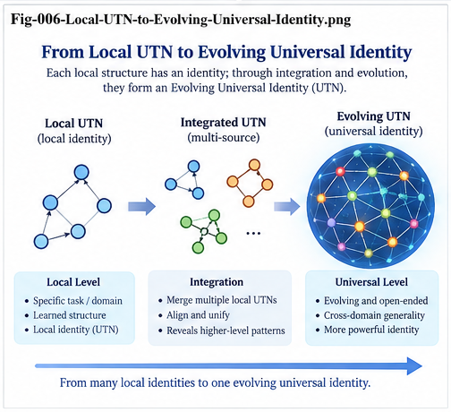

# GFSFUI-006 — Local UTN, Context-Preserving Unification, and Fold–Unfold Identity

**GFSFUI Series — General Framework of Structural Folding and Unfolding Intelligence**

**Document ID:** GFSFUI-006
**Status:** Core Identity and Unification Paper
**Version:** v1.0
**Language:** English

---

## Abstract

Structural Folding requires individuals to become comparable across observations, programs, contexts, and time. Structural Unfolding requires reusable structural knowledge to be projected back into a new local context.

This creates an identity problem.

A complete Universal Typing/Naming system would be useful, but requiring universal identity before Folding begins creates a bootstrapping dependency: structural equivalence is often discovered only after Folding, comparison, search, and validation have already occurred.

This paper develops a progressive identity model for the **General Framework of Structural Folding and Unfolding Intelligence (GFSFUI)**.

The central principle is:

> **Identity precedes Naming.**

GFSFUI therefore begins with **Local Identity** and **Local UTN**, preserving context, relations, history, and provenance. Structural Folding then discovers candidate cross-context equivalences. Two-Way Structural Search and counter-evidence testing validate or reject those equivalences. Repeatedly supported equivalences can be promoted toward higher-level structural identities and, where useful, Universal UTN.

The process is:

> **Local Identity → Local UTN → Structural Role → Candidate Unification → Two-Way Evidence → Certified Identity → Optional Universal Naming**

This creates a second important principle:

> **Universalization can be an output of Structural Folding rather than solely a prerequisite for Structural Folding.**

The resulting process, called **Fold-Guided UTN Evolution**, allows identity infrastructure and Structural Intelligence to evolve together.

---

# 1. The Identity Problem in Fold–Unfold Intelligence

Structural Folding compares individuals.

But comparison immediately raises a question:

> **What exactly is being compared?**

Suppose two software systems contain:

```text id="utn01"
OrderService.submitOrder()
```

and:

```text id="utn02"
CheckoutProcessor.placePurchase()
```

The names differ.

The classes differ.

The projects differ.

The implementation details differ.

Yet structurally they may perform closely related roles.

If identity is defined only by literal names, the relationship may be missed.

---

# 2. The Opposite Problem

Over-normalization creates the opposite danger.

Suppose two methods are both labeled:

```text id="utn03"
SERVICE
```

but one performs:

```text id="utn04"
Payment Authorization
```

while another performs:

```text id="utn05"
Image Resizing
```

Treating them as identical simply because they share a broad role destroys important context.

Thus GFSFUI must solve two competing problems:

> **Make identities comparable without erasing meaningful difference.**

---

# 3. Identity Is Not Naming

A fundamental distinction is:

$$
Identity \neq Name
$$

A name is usually a symbolic handle for an identity.

For example:

```text id="utn06"
"Cat"
```

is not the animal itself.

Likewise:

```text id="utn07"
OrderService
```

is not the complete structural identity of a software component.

The name is a reference mechanism.

The underlying identity may involve:

* structure,
* state,
* role,
* relations,
* context,
* history,
* continuity,
* behavior,
* and provenance.

---

# 4. Identity Can Exist Before Language

Consider perception.

A child may observe:

```text id="utn08"
Observation 1
Observation 2
Observation 3
```

and begin treating them as members of the same kind before learning the word:

```text id="utn09"
cat
```

Concept formation can therefore precede explicit naming.

The process may be:

```text id="utn10"
Observations
    ↓
Candidate Structural Identity
    ↓
Concept
    ↓
Optional Linguistic Name
```

This supports the principle:

> **Naming is one operational layer above identity resolution.**

---

# 5. Identity in Natural Systems

Nature does not require external symbolic names for entities to exist.

An entity may be distinguished through:

* physical continuity,
* causal continuity,
* location,
* state,
* relations,
* history,
* structural properties,
* and interaction patterns.

An ideal observer with complete knowledge of all these properties would often need names mainly as convenient handles.

Real intelligence, however, does not have complete knowledge.

It sees partial observations.

Therefore the practical problem is:

> **Identity Resolution under Partial Observation**

---

# 6. Partial Observation

Suppose an intelligent system observes:

$$
O_t
$$

at time \(t\).

It must determine whether:

$$
O_t
$$

belongs to an already known entity \(E_i\), or represents something new.

Conceptually:

```text id="utn11"
New Observation
      ↓
Structural Representation
      ↓
Compare with Existing Identities
      ↓
   ┌───────┴───────┐
   ↓               ↓
Match             No Match
   ↓               ↓
Unify         New Identity
```

This is an identity-resolution problem before it is a naming problem.

---

# 7. Identity in Human Perception

A human can observe the same cat:

* from different angles,
* at different distances,
* under different lighting,
* while moving,
* while sleeping,
* years apart.

The raw observations differ.

Yet perception attempts to maintain:

> **Same persistent entity**

This requires some form of structural unification across changing observations.

---

# 8. Identity in Autonomous Systems

Autonomous driving provides another example.

A vehicle may be observed through:

```text id="utn12"
Camera Frame t1
Camera Frame t2
LiDAR
Radar
Tracking State
```

These observations must often be unified into:

```text id="utn13"
Persistent Vehicle Entity X
```

The symbolic identifier `Vehicle-X` is useful.

But the deeper intelligence lies in deciding that the observations belong to the same entity.

---

# 9. Identity in World Models

A useful world-model entity may require:

```text id="utn14"
Entity
│
├── Current State
├── Relations
├── History
├── Context
├── Observations
├── Possible Future
└── Provenance
```

A name alone is insufficient.

The important question is:

> **Should this new observation Fold back into an existing persistent entity, or create a new one?**

This is structurally similar to GFSFUI Folding.

---

# 10. GenericContainerStarmap as an Identity Substrate

GenericContainerStarmap can support identity resolution.

```text id="utn15"
Unknown Individual
      ↓
GenericContainerStarmap
      ↓
Metric / Structural Comparison
      ↓
Existing CCC / Identity?
   ↙                 ↘
 Yes                 No
  ↓                   ↓
Unify           Candidate New Identity
```

Thus the Starmap is not only a Folding representation.

It can also become an:

> **Identity Resolution Substrate**

---

# 11. The UTN Bootstrapping Problem

Cross-context Folding benefits from normalized identities.

This suggests:

```text id="utn16"
Universal UTN
      ↓
Structural Folding
```

But complete universalization may itself require knowledge obtained through Structural Folding.

For example:

```text id="utn17"
Program A Symbol
       +
Program B Symbol
       ↓
Structural Comparison
       ↓
Repeated Equivalent Role
       ↓
Candidate Universal Identity
```

Therefore:

```text id="utn18"
UTN needs Folding
      ↕
Folding needs UTN
```

This is the bootstrapping problem.

---

# 12. Do Not Solve the Entire Universe First

A tempting response is:

> Build a complete universal naming system before Folding.

This can create an unnecessarily large prerequisite.

The domain may contain:

* unknown concepts,
* evolving roles,
* local conventions,
* ambiguous equivalences,
* and structures not yet discovered.

GFSFUI therefore adopts a different strategy:

> **Localize first. Universalize progressively.**

---

# 13. Local UTN

A Local UTN provides enough normalization for structural operations inside a bounded context.

For example:

```text id="utn19"
Project A

OrderController
      ↓
CONTROLLER

OrderService
      ↓
SERVICE

OrderRepository
      ↓
REPOSITORY
```

Another project may use:

```text id="utn20"
Project B

PurchaseEndpoint
      ↓
ENDPOINT

CheckoutService
      ↓
SERVICE

PurchaseStore
      ↓
STORE
```

The local mappings need not initially assert universal equivalence.

They only expose comparable structural information.

---

# 14. Structural Roles

The next layer may abstract local identities into structural roles.

For example:

```text id="utn21"
CONTROLLER
ENDPOINT
      ↓
ENTRY
```

and:

```text id="utn22"
REPOSITORY
STORE
      ↓
PERSISTENCE
```

This produces:

```text id="utn23"
ENTRY
  ↓
DOMAIN-SERVICE
  ↓
PERSISTENCE
```

Now two programs can become structurally comparable without requiring identical names.

---

# 15. Universalization Can Be Discovered

Suppose repeated Folding finds that several local identities have:

* similar upstream relations,
* similar downstream relations,
* similar Bigram structure,
* similar Trigram structure,
* similar outcomes,
* similar context,
* and similar failure behavior.

The system can propose:

> **Candidate Cross-Context Equivalence**

Thus:

```text id="utn24"
Local Identity A
       +
Local Identity B
       ↓
Structural Folding
       ↓
Candidate Equivalence
```

Universalization begins as a hypothesis.

---

# 16. Universalization Is Not Automatic

Structural similarity does not prove identity.

Two components may look similar but differ in an important context.

Therefore Candidate Equivalence must be tested.

```text id="utn25"
Candidate Equivalence
       ↓
Two-Way Structural Search
       ↓
Support
       +
Counter-Evidence
```

Only sufficiently validated equivalence should be promoted.

---

# 17. Two-Way Identity Search

Suppose:

$$
A \approx B
$$

is proposed.

The system can ask:

* Where does A behave like B?
* Where does B behave like A?
* Where does A occur without B-like structural relations?
* Where does B occur under a different outcome?
* Do they share upstream structure?
* Do they share downstream structure?
* Do they share DNA?
* Do they occupy similar contexts?

This creates evidence for or against unification.

---

# 18. Counter-Evidence for Identity

Suppose two local services appear equivalent.

Search may reveal:

```text id="utn26"
A:
ENTRY → A → PERSISTENCE

B:
ENTRY → B → EXTERNAL-PAYMENT
```

The difference may be structurally important.

The correct result may therefore be:

```text id="utn27"
A ≠ B
```

or:

```text id="utn28"
A and B share a higher-level role
but require different Delta
```

Counter-evidence prevents destructive over-unification.

---

# 19. Context-Preserving Unification

A useful unification should preserve both:

> **what is shared**

and:

> **where the identities remain different**

Conceptually:

$$
Identity_A =
Core + Context_A + \Delta_A
$$

$$
Identity_B =
Core + Context_B + \Delta_B
$$

The common Core supports unification.

The context and Delta preserve local meaning.

---

# 20. Core Without Context Is Dangerous

Suppose two structures share:

```text id="utn29"
SERVICE → PERSISTENCE
```

but one belongs to:

```text id="utn30"
Financial Transaction
```

and the other to:

```text id="utn31"
Image Metadata Storage
```

The structural relation is similar.

The operational meaning is not identical.

Therefore a structural identity should not be reduced to one abstract label.

---

# 21. Structural Meaning

A useful conceptual representation is:

$$
StructuralMeaning(e) =
Identity(e)
+
Role(e)
+
Context(e)
+
Relations(e)
+
History(e)
$$

This is not intended as a strict numeric equation.

It expresses an architectural requirement:

> **Meaning emerges from identity in context and relation.**

---

# 22. Context Is a Coordinate System

Context can be viewed as a coordinate system for structural identity.

The same Core may appear differently in different contexts.

```text id="utn32"
Structural Core
      │
   Context A
      ↓
Local Form A
```

and:

```text id="utn33"
Structural Core
      │
   Context B
      ↓
Local Form B
```

This becomes especially important during Unfolding.

---

# 23. Fold Separates Core from Recoverable Context

A strong Fold should not erase the path back to concrete reality.

A useful principle is:

> **Fold does not delete Context; it separates reusable Core from recoverable Context.**

Conceptually:

```text id="utn34"
Local Individual
      ↓
FOLD
      ↓
Structural Core
      +
Context / Delta / Provenance
```

The Core becomes reusable.

The local information remains recoverable.

---

# 24. Provenance Is Mandatory

Every promoted structural identity should remain traceable.

```text id="utn35"
Certified Structural Identity
          ↕
Candidate Equivalence
          ↕
Local UTN
          ↕
Original Identity
          ↕
Original Individual
          ↕
Source
```

Without provenance, universalization becomes difficult to audit.

---

# 25. Provenance Is More Than Debug Metadata

Provenance supports:

* verification,
* counter-evidence search,
* rollback,
* identity splitting,
* context recovery,
* source inspection,
* and future Refolding.

Thus provenance participates directly in intelligence.

It is not merely administrative metadata.

---

# 26. Minimum Sufficient UTN

GFSFUI does not require complete Universal UTN to begin.

The minimum useful identity layer needs four properties.

## 26.1 Comparable

Two identities must expose enough structure to be compared.

## 26.2 Context-Preserving

Normalization must not destroy meaningful local context.

## 26.3 Traceable

The structural identity must remain connected to its source.

## 26.4 Promotable

A local identity must be capable of becoming part of a higher-level identity when evidence supports it.

These four properties define:

> **Minimum Sufficient UTN**

---

# 27. A Progressive UTN Ladder

A practical progression is:

```text id="utn36"
L0 — Raw Identity
        ↓
L1 — Local UTN
        ↓
L2 — Structural Role
        ↓
L3 — Candidate Cross-Context UTN
        ↓
L4 — Certified UTN
        ↓
L5 — Cross-Domain / Universal UTN
```

The system does not need L5 before beginning useful Folding.

L1 and L2 may already be sufficient.

---



*Fig-006 — Local UTN to Evolving Universal Identity. Local identities are preserved and normalized first, then progressively compared, challenged, validated, and promoted toward broader structural identities through Fold-Guided UTN Evolution.*

---

# 28. L0 — Raw Identity

Examples:

```text id="utn37"
com.shop.OrderService.submit()
```

```text id="utn38"
camera_detection_17_frame_205
```

```text id="utn39"
gene_record_local_42
```

These identities are concrete but poorly generalized.

---

# 29. L1 — Local UTN

The identity is normalized inside a bounded context.

For example:

```text id="utn40"
PROJECT-A::ORDER-SERVICE::SUBMIT
```

The goal is operational consistency, not universality.

---

# 30. L2 — Structural Role

The system extracts a role:

```text id="utn41"
DOMAIN-SERVICE
```

or:

```text id="utn42"
PERSISTENCE
```

or:

```text id="utn43"
VALIDATION
```

This allows cross-local comparison.

---

# 31. L3 — Candidate Cross-Context UTN

Repeated structural similarity produces a candidate equivalence.

```text id="utn44"
Project A: OrderService
Project B: CheckoutProcessor
Project C: PurchaseService
            ↓
Candidate Structural Identity
```

The equivalence remains provisional.

---

# 32. L4 — Certified UTN

Two-Way Search, counter-evidence, and validation support promotion.

```text id="utn45"
Candidate Identity
      ↓
Evidence
      ↓
Counter-Evidence
      ↓
Validation
      ↓
Certified UTN
```

The identity is now reusable with explicit evidence.

---

# 33. L5 — Universal UTN

Some certified identities may eventually generalize across many contexts or domains.

These can become:

> **Cross-Domain / Universal UTN**

But this should be an evidence-driven promotion, not a premature assumption.

---

# 34. Fold-Guided UTN Evolution

The entire process can be expressed as:

```text id="utn46"
Minimal Local UTN
       ↓
Local Folding
       ↓
Structural Similarity
       ↓
Candidate Cross-Context Equivalence
       ↓
Two-Way Search
       ↓
Counter-Evidence
       ↓
Certified Unification
       ↓
Higher-Level UTN
       ↓
Better Folding
```

This is:

> **Fold-Guided UTN Evolution**

---

# 35. The Progressive Spiral

UTN and Folding can therefore evolve together:

```text id="utn47"
Local UTN
    ↓
Better Fold
    ↓
Better Structural Comparison
    ↓
Better Identity Hypotheses
    ↓
Better Search
    ↓
Better Certified UTN
    ↓
Better Fold
    ↺
```

The apparent chicken-and-egg problem becomes a progressive spiral.

---

# 36. Structural Search Is an Identity Engine

The Structural Search Plane can search identity through:

```text id="utn48"
Raw Identity
     ↕
Local UTN
     ↕
Structural Role
     ↕
CCC
     ↕
DNA
     ↕
Relations
     ↕
Outcome
     ↕
Context
```

Thus identity resolution is not isolated from the rest of GFSFUI.

It uses the same structural memory.

---

# 37. DNA Can Support Identity

Two locally named objects may share structural DNA.

For example:

```text id="utn49"
Object A:
VALIDATE → AUTHORIZE → SERVICE

Object B:
CHECK → PERMISSION → PROCESS
```

After role normalization:

```text id="utn50"
VALIDATION → AUTHORIZATION → DOMAIN-ACTION
```

This shared DNA provides evidence of structural equivalence.

---

# 38. DNA Does Not Prove Identity

The same DNA may appear in unrelated contexts.

Therefore:

```text id="utn51"
Shared DNA
      ↓
Candidate Equivalence
```

not:

```text id="utn52"
Shared DNA
      ↓
Guaranteed Same Identity
```

Context and counter-evidence remain necessary.

---

# 39. Metric and Identity Can Correct Each Other

Suppose the metric places two individuals far apart, but identity search repeatedly finds:

* same structural role,
* same DNA,
* same outcome,
* similar relations.

This may indicate that the metric is missing an important dimension.

Conversely, metric-near individuals with different structural roles may reveal over-generalization.

Thus:

> **Identity resolution can improve Folding, and Folding can improve identity resolution.**

---

# 40. Identity Confidence

Identity need not always be binary.

A system may maintain:

```text id="utn53"
Candidate Identity
│
├── Structural Similarity
├── Role Agreement
├── DNA Agreement
├── Context Agreement
├── Outcome Agreement
├── Counter-Evidence
└── Provenance
```

This allows identity confidence to evolve with evidence.

---

# 41. Identity Splitting

A previously unified identity may later prove too broad.

Suppose:

```text id="utn54"
Certified Identity X
```

accumulates repeated counter-evidence.

The system may split it:

```text id="utn55"
Identity X
   ├── X-A
   └── X-B
```

with:

```text id="utn56"
Shared Core
+
Different Context / Delta
```

Universalization is therefore reversible.

---

# 42. Identity Merging

The opposite can also occur.

Two identities may remain separate until enough evidence accumulates.

```text id="utn57"
Identity A
Identity B
    ↓
Repeated Structural Equivalence
    ↓
Candidate Merge
    ↓
Validation
    ↓
Shared Higher-Level Identity
```

Thus identity structures can grow through both splitting and merging.

---

# 43. Identity Is a Continual-Learning Object

UTN should not be treated as a frozen dictionary.

It can evolve through:

```text id="utn58"
Observe
  ↓
Compare
  ↓
Unify / Separate
  ↓
Search
  ↓
Validate
  ↓
Promote / Split / Merge
  ↓
Refold
```

This makes identity part of Continual Structural Learning.

---

# 44. Fold Direction

During Folding:

```text id="utn59"
Local Identity
      ↓
Structural Role
      ↓
Shared Structure
      ↓
Candidate Higher-Level Identity
```

The direction is:

> **Local → Structural**

or, when justified:

> **Local → More Universal**

---

# 45. Unfold Direction

During Unfolding, the direction reverses functionally.

```text id="utn60"
Structural Identity
       ↓
Target Context
       ↓
Local Resolution
       ↓
New Local Identity
```

Thus:

> **Structural → New Local**

This is essential for generation.

---

# 46. Fold and Unfold Are Context-Asymmetric

Suppose:

$$
Fold(x,Context_A)
\rightarrow
S
$$

Then:

$$
Unfold(S,Context_B)
\rightarrow
x_B
$$

Generally:

$$
x_B \neq x
$$

because the target context differs.

This is expected.

Unfolding is not exact reconstruction.

It is context-conditioned structural projection.

---

# 47. Context-Preserving Fold–Unfold

The complete identity relation is:

```text id="utn61"
Local Object A
      ↓
Context A
      ↓
Fold
      ↓
Structural Identity S
      ↓
Context B
      ↓
Unfold
      ↓
Local Object B
```

The shared structure connects A and B.

The contexts explain their differences.

---

# 48. CallingGraph Example

Suppose Program A contains:

```text id="utn62"
OrderController
    ↓
OrderService
    ↓
OrderRepository
```

The Fold may produce:

```text id="utn63"
ENTRY
  ↓
DOMAIN-SERVICE
  ↓
PERSISTENCE
```

A new Program B may Unfold this as:

```text id="utn64"
CheckoutEndpoint
    ↓
PurchaseProcessor
    ↓
PurchaseStore
```

The local names differ.

The structural identity is preserved.

---

# 49. Provenance Across CallingGraph Folding

The Folded pattern should still support:

```text id="utn65"
ENTRY
  ↕
OrderController
  ↕
Program A
```

and:

```text id="utn66"
DOMAIN-SERVICE
  ↕
OrderService
  ↕
Program A
```

This makes the structural abstraction inspectable.

---

# 50. Provenance Across CallingGraph Unfolding

Likewise, after generation:

```text id="utn67"
DOMAIN-SERVICE
      ↓
Unfolded As
      ↓
PurchaseProcessor
      ↓
Program B
```

The system should know which structural identity produced the new local element.

This creates bidirectional traceability.

---

# 51. Structural Identity as a Control Handle

A certified structural identity can become a control handle.

For example:

```text id="utn68"
AUTHORIZATION
```

may be required in a candidate CallingGraph.

During code generation, the system can verify whether a concrete local implementation actually realizes that structural role.

Thus identity supports governance as well as abstraction.

---

# 52. Identity and Structural Falsification

A structural identity should also be falsifiable.

Suppose:

```text id="utn69"
A ≈ B
```

is currently accepted.

The system should remain able to ask:

> **Where does A behave differently from B?**

Repeated differences may create:

```text id="utn70"
Shared Core
   ├── Delta A
   └── Delta B
```

or force complete separation.

---

# 53. Counter-Evidence Prevents Identity Collapse

Without counter-evidence, aggressive unification can collapse distinct concepts into one.

This is dangerous because it destroys precisely the Delta that Structural Intelligence needs.

Therefore:

> **A good unification mechanism must preserve the right to remain different.**

---

# 54. Structural Equivalence Versus Exact Identity

GFSFUI should distinguish:

```text id="utn71"
Exact Identity
```

from:

```text id="utn72"
Structural Equivalence
```

Two objects may be structurally equivalent for one task while remaining distinct entities.

For example:

```text id="utn73"
OrderRepository
PurchaseStore
```

may be structurally equivalent under a persistence-role metric without being the same software object.

This distinction prevents ontological overclaiming.

---

# 55. Task-Relative Identity

Some identity relations may be task-dependent.

Two structures may be equivalent for:

```text id="utn74"
Routing
```

but not for:

```text id="utn75"
Security Analysis
```

Thus identity can be:

> **Perspective-relative**

This connects identity directly to multi-metric Structural Folding.

---

# 56. Multiple Identity Perspectives

A system may maintain:

```text id="utn76"
Functional Identity
Structural Identity
Behavioral Identity
Temporal Identity
Security Identity
Domain Identity
```

These need not always agree.

Their disagreement can itself reveal Delta.

---

# 57. Identity and Per-Node Intelligence

Different structural nodes may require different identity policies.

For example:

```text id="utn77"
High-Level Node
    ↓
Broad Structural Role

Low-Level Node
    ↓
Fine-Grained Local Identity
```

Thus UTN can also be hierarchical.

The required identity resolution should match the granularity of the intelligence task.

---

# 58. Avoid Premature Universalization

Premature universalization can create several problems:

* false equivalence,
* context loss,
* provenance loss,
* semantic collapse,
* difficult rollback,
* and unnecessary ontology complexity.

Therefore:

> **Universal identity should be earned through structural evidence.**

---

# 59. Avoid Permanent Local Isolation

The opposite extreme is also harmful.

If every project keeps completely isolated names:

```text id="utn78"
Project A Identity
Project B Identity
Project C Identity
```

the system cannot accumulate cross-project structural knowledge.

Therefore Local UTN must be:

> **Promotable**

Local identity is the starting point, not the final boundary.

---

# 60. The Balance

The desired architecture is:

```text id="utn79"
LOCAL ENOUGH
to preserve meaning

        +

GENERAL ENOUGH
to support comparison

        +

TRACEABLE ENOUGH
to recover source

        +

PROMOTABLE ENOUGH
to support future unification
```

This is the practical role of Local UTN in GFSFUI.

---

# 61. Local UTN in Biomedical Structural Search

The same principle applies outside software.

Different datasets may use:

* different gene identifiers,
* different measurement conventions,
* different phenotype labels,
* different experimental contexts.

Immediate global normalization may be difficult.

A local identity layer can preserve dataset-specific meaning while exposing comparable structural roles.

Cross-dataset equivalence can then be tested rather than assumed.

---

# 62. Local UTN in Stock-Market Folding

Stock-market representations may also contain local identity.

For example:

```text id="utn80"
Instrument
Time Window
Market Regime
Sequence Role
Feature Context
```

A pattern in one instrument should not automatically be treated as identical to the same numerical pattern in another context.

Local context remains part of structural meaning.

---

# 63. Local UTN Across the Three Canonical Demonstrations

```text id="utn81"
Stock
  ↓
Local Sequence / Market Identity
  ↓
Cross-Context Structural Pattern

Biomedical
  ↓
Local Experimental Identity
  ↓
Candidate Biological Equivalence

CallingGraph
  ↓
Local Program Identity
  ↓
Cross-Program Structural Role
```

The identity problem is therefore general.

---

# 64. UTN as Infrastructure and Product

UTN has two roles.

## Role I — Infrastructure

It provides enough comparability to begin Folding.

## Role II — Product

Folding and Structural Search discover better identities.

Thus:

> **UTN is both infrastructure for Structural Intelligence and an evolving product of Structural Intelligence.**

This resolves the apparent bootstrapping paradox.

---

# 65. Fold–Search–Unify

The identity-specific loop is:

```text id="utn82"
Local Identity
      ↓
Fold
      ↓
Candidate Structural Equivalence
      ↓
Search
      ↓
Support + Counter-Evidence
      ↓
Unify / Separate / Refine
```

This can operate continuously.

---

# 66. Unfold–Resolve–Validate

The reverse identity loop is:

```text id="utn83"
Structural Identity
      ↓
Target Context
      ↓
Local Resolution
      ↓
Candidate Local Identity
      ↓
Validation
```

If local resolution fails, the structural identity may need refinement.

Thus Unfolding tests the quality of the Fold.

---

# 67. Fold–Unfold Identity Loop

The full cycle is:

```text id="utn84"
LOCAL IDENTITIES
      │
      ▼
LOCAL UTN
      │
      ▼
STRUCTURAL FOLD
      │
      ▼
CANDIDATE EQUIVALENCE
      │
      ▼
TWO-WAY SEARCH
      │
      ▼
COUNTER-EVIDENCE
      │
      ▼
CERTIFIED STRUCTURAL IDENTITY
      │
      ▼
TARGET CONTEXT
      │
      ▼
UNFOLD / LOCAL RESOLUTION
      │
      ▼
NEW LOCAL IDENTITY
      │
      ▼
VALIDATION
      │
      └────────────→ REFOLD
```

---

# 68. Identity Memory

A mature system may retain:

```text id="utn85"
Identity Memory
│
├── Raw Identities
├── Local UTNs
├── Structural Roles
├── Candidate Equivalences
├── Certified Equivalences
├── Rejected Equivalences
├── Context
├── Delta
├── Evidence
├── Counter-Evidence
└── Provenance
```

This turns identity resolution into accumulated Collective Learning.

---

# 69. Negative Identity Knowledge

Rejected equivalence is useful.

Suppose the system has already established:

```text id="utn86"
A and B look similar
but must NOT be unified
under Security Perspective P
```

Future Folding should be able to retrieve this knowledge.

This prevents repeated identity mistakes.

---

# 70. Identity Evolution Can Be Local

Like other GFSFUI learning, identity refinement can often be localized.

A new counterexample may require:

```text id="utn87"
Split Identity X
```

without rebuilding the entire UTN system.

This supports low-blast-radius identity evolution.

---

# 71. Identity Evolution Can Also Be Global

Some discoveries may reveal that a high-level identity is fundamentally wrong.

In such cases, wider Refolding may be necessary.

GFSFUI does not assume all identity changes are local.

It prefers the smallest justified scope.

---

# 72. Progressive UTN Bootstrapping

The practical engineering path is:

```text id="utn88"
Step 1
Use raw/local identities.

Step 2
Add minimal Local UTN.

Step 3
Expose structural roles.

Step 4
Fold populations.

Step 5
Discover candidate equivalences.

Step 6
Search for support and counter-evidence.

Step 7
Promote validated identities.

Step 8
Use them to improve future Folding.

Step 9
Use Unfolding to test reverse projection.

Step 10
Continue toward broader UTN only where evidence justifies it.
```

This avoids waiting for a perfect ontology.

---

# 73. Why This Matters for GFSFUI

Without identity resolution, Structural Folding fragments.

Without context preservation, Structural Folding over-generalizes.

Without provenance, Structural Folding becomes difficult to audit.

Without promotability, Collective Learning remains trapped in local silos.

Without reverse resolution, Structural Unfolding cannot return abstract knowledge to concrete environments.

Local UTN therefore sits directly on the Fold–Unfold boundary.

---

# 74. The Deep Fold–Unfold Identity Relation

The identity transformation can be expressed as:

$$
Local_A
\xrightarrow{Fold}
Structural
\xrightarrow{Unfold(Context_B)}
Local_B
$$

with provenance preserving:

$$
Local_A
\leftrightarrow
Structural
\leftrightarrow
Local_B
$$

The structural representation is neither identical to A nor B.

It is the reusable bridge between them.

---

# 75. Universal Naming Becomes Optional

Some structural identities may eventually benefit from globally stable names.

Others may not.

A mature framework should therefore distinguish:

```text id="utn89"
Universal Structural Identity
```

from:

```text id="utn90"
Universal Human-Readable Name
```

The first may be necessary for machine interoperability.

The second may primarily improve communication.

This further separates identity from naming.

---

# 76. Operational Handles

Digital systems still need handles.

Possible handles include:

* IDs,
* strings,
* keys,
* paths,
* addresses,
* URIs,
* hashes,
* or UTN tokens.

These are implementation mechanisms.

They should point to richer structural identities rather than being mistaken for the identities themselves.

---

# 77. A Broader Interpretation of UTN

Within GFSFUI, UTN can therefore be interpreted more broadly as supporting:

> **Typing**

> **Identity Resolution**

> **Context-Preserving Unification**

> **Operational Naming**

The original naming function remains useful, but it sits inside a larger structural identity problem.

---

# 78. Canonical Identity Principles

### Principle 1 — Identity Precedes Naming

Names are handles for identities, not the source of identity itself.

### Principle 2 — Begin Locally

Do not require universal identity before useful Folding can start.

### Principle 3 — Preserve Context

Normalization must not erase conditions that determine meaning.

### Principle 4 — Preserve Provenance

Every abstraction should remain traceable to concrete sources.

### Principle 5 — Treat Equivalence as a Hypothesis

Structural similarity creates Candidate Equivalence, not automatic identity.

### Principle 6 — Search for Counter-Evidence

Ask where apparently equivalent identities behave differently.

### Principle 7 — Preserve Delta

Unification should retain meaningful local difference.

### Principle 8 — Promote Through Evidence

Higher-level identity should be earned through validation.

### Principle 9 — Allow Split and Merge

Identity structures must remain revisable.

### Principle 10 — Use Unfolding as a Test

If a structural identity cannot be resolved coherently in new contexts, the Fold may require refinement.

### Principle 11 — Keep UTN Promotable

Local identity should support future cross-context learning.

### Principle 12 — Let UTN and Structural Intelligence Co-Evolve

Better identity improves Folding; better Folding improves identity.

---

# 79. What This Framework Does Not Claim

This paper does not claim that:

* structural similarity establishes ontological identity;
* one global naming system can be defined immediately;
* all contexts can be normalized safely;
* provenance alone guarantees semantic correctness;
* Local UTN solves ontology alignment;
* identity confidence is always reducible to one probability;
* all identity changes are local;
* or Universal UTN is unnecessary.

Instead, it proposes a progressive architecture in which useful Structural Intelligence can begin before universal identity is complete.

---

# 80. Canonical Fold-Guided UTN Evolution

The core process is:

```text id="utn91"
RAW IDENTITY
     ↓
LOCAL IDENTITY
     ↓
LOCAL UTN
     ↓
STRUCTURAL ROLE
     ↓
FOLD
     ↓
CANDIDATE CROSS-CONTEXT EQUIVALENCE
     ↓
TWO-WAY STRUCTURAL SEARCH
     ↓
SUPPORT + COUNTER-EVIDENCE
     ↓
VALIDATE
     ↓
CERTIFIED IDENTITY
     ↓
OPTIONAL UNIVERSAL UTN
     ↓
BETTER FOLDING
     ↺
```

---

# 81. Canonical Fold–Unfold Identity Map

```text id="utn92"
                    LOCAL WORLD A
                         │
                         ▼
                    RAW IDENTITY
                         │
                         ▼
                      LOCAL UTN
                         │
                         ▼
                       FOLD
                         │
                         ▼
              STRUCTURAL IDENTITY
                 /       |       \
                /        |        \
          CONTEXT     CORE       DELTA
                \        |        /
                 \       |       /
                         ▼
                STRUCTURAL SEARCH
                         │
                         ▼
               CERTIFIED IDENTITY
                         │
                         ▼
                  TARGET CONTEXT B
                         │
                         ▼
                       UNFOLD
                         │
                         ▼
                  LOCAL IDENTITY B
                         │
                         ▼
                     VALIDATE
                         │
                         └────────────→ REFOLD
```

---

# 82. Final Perspective

The Fold–Unfold problem is also an identity problem.

Folding must recognize when different concrete forms share reusable structure.

Unfolding must convert that reusable structure back into a new concrete form.

A complete universal naming system is useful, but it need not be completed first.

The system can begin with Local Identity.

It can normalize enough to compare.

It can preserve context.

It can preserve provenance.

It can Fold.

It can search.

It can discover candidate equivalence.

It can search for counter-evidence.

It can promote useful identities.

And it can use Unfolding itself to test whether those identities survive new contexts.

The resulting progression is:

```text id="utn93"
LOCAL
  ↓
COMPARE
  ↓
FOLD
  ↓
UNIFY
  ↓
CHALLENGE
  ↓
CERTIFY
  ↓
UNFOLD
  ↓
NEW LOCAL
  ↓
REFOLD
```

Universal identity therefore does not have to stand outside Structural Intelligence as a completed prerequisite.

It can grow with Structural Intelligence.

---

## Canonical Summary

> **Identity is deeper than Naming.**

> **Local Identity is sufficient to begin Structural Intelligence when it is made comparable, context-preserving, traceable, and promotable.**

> **GenericContainerStarmap can serve as both a Folding representation and an identity-resolution substrate.**

> **Structural similarity creates Candidate Equivalence rather than automatic identity.**

> **Two-Way Structural Search and counter-evidence test whether Candidate Equivalence survives across contexts.**

> **Context-Preserving Unification retains both shared Core and meaningful Delta.**

> **Provenance preserves the path from abstract identity back to concrete source.**

> **Universalization can be an output of Folding rather than solely a prerequisite for Folding.**

> **Unfolding projects Structural Identity into a new local context and therefore provides a reverse test of Folding quality.**

> **UTN is both infrastructure for Structural Intelligence and an evolving product of Structural Intelligence.**

The canonical progression is:

> **Local Identity → Local UTN → Structural Role → Candidate Unification → Two-Way Evidence → Certified Identity → Optional Universal Naming**

The canonical co-evolution loop is:

> **Local UTN → Fold → Structural Similarity → Candidate Equivalence → Search → Counter-Evidence → Certified Unification → Better UTN → Better Fold / Unfold**

And the deepest operational principle is:

> **Nature has entities. Perception produces local identities. Intelligence unifies identities. Language gives some identities names. Digital systems turn those names into operational handles.**

---

**GFSFUI-006**
**Local UTN, Context-Preserving Unification, and Fold–Unfold Identity**
