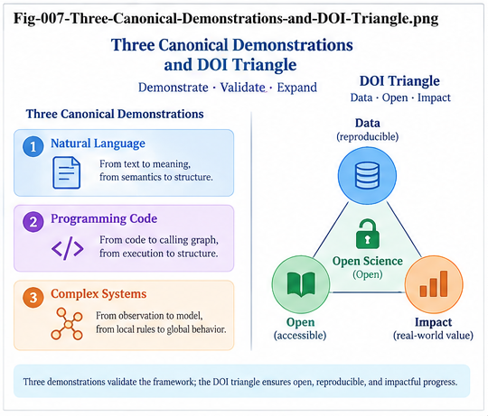

# GFSFUI-007 — Three Canonical Demonstrations and the Research Roadmap

**GFSFUI Series — General Framework of Structural Folding and Unfolding Intelligence**

**Document ID:** GFSFUI-007
**Status:** Canonical Demonstrations and Research Roadmap
**Version:** v1.0
**Language:** English

---

## Abstract

The **General Framework of Structural Folding and Unfolding Intelligence (GFSFUI)** proposes a reusable structural intelligence lifecycle:

> **Represent → Fold → Localize → Search → Challenge → Unfold → Validate → Grow → Refold**

A general framework becomes useful only when its mechanisms can be instantiated in concrete domains without losing their common structural form.

This paper organizes three canonical demonstrations of GFSFUI:

1. **Stock Market Structural Folding** — large-population Structural Folding, localization, and prediction;
2. **Biomedical Structural Search** — sparse-data hypothesis formation, counter-evidence search, Structural Falsification, and continual growth;
3. **CallingGraph Fold–Unfold Intelligence** — certified structural memory, goal-conditioned Structural Search, controlled Unfolding, validation, certification, and Refolding.

These demonstrations are deliberately different.

The first emphasizes **Folding**.

The second emphasizes **Search, Falsification, and Growth**.

The third emphasizes **Unfolding and Generation**.

Together they form a teaching progression:

> **Stock teaches Structural Folding.**

> **Biomedical teaches Structural Search, Falsification, and Growth.**

> **CallingGraph teaches Structural Unfolding and Generation.**

This paper also defines the relationship among three complementary DOI repositories:

* **SMSF** — Stock Market Structural Folding;
* **CSFR** — reusable Structural Folding runtime and algorithmic mechanisms;
* **GFSFUI** — the general Fold–Unfold intelligence framework.

Rather than forming a simple linear hierarchy, the three repositories form a mutually reinforcing research triangle:

> **Concrete Application ↔ Reusable Mechanism ↔ General Framework**

The final sections present a research roadmap toward multi-domain validation, Structural Search infrastructure, sparse-data learning, CallingGraph generation, Fold-Guided UTN Evolution, Per-Node Intelligence, local Brain-Unit growth, certification, and Collective Structural Learning.

---

# 1. Why Three Demonstrations?

A general intelligence framework should not depend on one domain.

But beginning with excessive abstraction can make the framework difficult to understand.

GFSFUI therefore uses three deliberately selected demonstrations.

Each exposes a different part of the same structural lifecycle.

```text id="road01"
STOCK
  ↓
FOLD

BIOMEDICAL
  ↓
SEARCH / FALSIFY / GROW

CALLINGGRAPH
  ↓
UNFOLD / GENERATE / CERTIFY
```

Together they make the full architecture visible.

---

# 2. The Common Structural Skeleton

Although the domains differ, all three can be expressed through a common skeleton:

```text id="road02"
Concrete Individuals
        ↓
Policy-Guided Structuralization
        ↓
GenericContainerStarmap
        ↓
Structural Comparison
        ↓
Structural Folding
        ↓
CCC / DNA / Core ± Delta
        ↓
Structural Localization
        ↓
Per-Node Intelligence
        ↓
Structural Search
        ↓
Support / Counter-Evidence
        ↓
Goal-Conditioned Action or Unfolding
        ↓
Validation
        ↓
Local Structural Growth
        ↓
Refold
```

Not every demonstration uses every stage equally.

That is intentional.

---

# 3. The Teaching Strategy

The demonstrations should be understood progressively.

## Demonstration I

First learn:

> **How many concrete individuals become reusable structural memory.**

## Demonstration II

Then learn:

> **How sparse new evidence can interrogate that memory and challenge a Candidate Fold.**

## Demonstration III

Finally learn:

> **How Folded structural memory can be Unfolded into a new candidate structure and returned as new experience.**

Thus the sequence is:

```text id="road03"
FOLD
  ↓
SEARCH / CHALLENGE / GROW
  ↓
UNFOLD / CERTIFY / REFOLD
```

---



*Fig-007 — Three Canonical Demonstrations and DOI Triangle. Stock demonstrates Structural Folding, Biomedical demonstrates Structural Search, Falsification, and Growth, and CallingGraph demonstrates Structural Unfolding and Generation. SMSF, CSFR, and GFSFUI form a complementary research triangle of concrete application, reusable mechanism, and general framework.*

---

# 4. Canonical Demonstration I — Stock Market Structural Folding

The stock-market domain provides a direct and intuitive demonstration of population-level Folding.

A large number of market sequences can be treated as structural individuals.

For example:

$$
S_1,S_2,\ldots,S_N
$$

Each sequence can be transformed into a GenericContainerStarmap.

The population can then be organized using Metric Similarity and Metric Differential structures.

---

# 5. Why Stock Is a Useful First Demonstration

Stock sequences provide several useful properties:

* many historical individuals,
* naturally ordered observations,
* measurable similarity,
* repeated patterns,
* variable outcomes,
* multiple possible metrics,
* and clear prediction/localization questions.

This makes the domain useful for explaining Structural Folding without requiring a large ontology first.

---

# 6. The Stock Folding Pipeline

A canonical flow is:

```text id="road04"
Historical Sequences
        ↓
GenericContainerStarmaps
        ↓
Metric Similarity
        ↓
Metric Differential Tree
        ↓
Cluster-Central CCC
        ↓
Per-Node Intelligence
        ↓
New Sequence Dispatch
        ↓
Localized Prediction / Analysis
```

The essential transformation is:

> **Many historical individuals → reusable structural memory**

---

# 7. Equal-Length Sequences as a Canonical Path

For teaching and engineering simplicity, equal-length sequences provide a useful initial representation.

For sequences:

$$
X=(x_1,x_2,\ldots,x_L)
$$

and cluster center:

$$
C=(c_1,c_2,\ldots,c_L)
$$

a metric can compare corresponding positions directly.

This makes:

* implementation simple,
* vectorization natural,
* caching straightforward,
* and runtime cost easier to understand.

---

# 8. Equal Length Is Not a Theoretical Requirement

GFSFUI does not require all sequences to have equal length.

Variable-length structures may use:

* alignment,
* sequence merging,
* path comparison,
* structural matching,
* or other more expensive algorithms.

Thus:

> **Equal length is a canonical engineering simplification, not a boundary of the framework.**

---

# 9. Stock Demonstrates the Metric Differential Principle

The stock demonstration makes one key transformation especially visible:

```text id="road05"
Similarity
    ↓
Shared Structure
    ↓
Difference Localization
    ↓
Dispatch
```

The Metric Differential Tree does more than cluster data.

It gives intelligence a structural address.

---

# 10. Cluster-Central CCC in the Stock Demonstration

A cluster can maintain a probability-oriented CCC.

Conceptually:

```text id="road06"
Cluster CCC
│
├── Representative Structure
├── Outcome Distribution
├── Dispatch Information
├── Local DNA
├── Local Delta
└── Provenance
```

A new sequence can be routed toward the most relevant structural neighborhood.

---

# 11. Per-Node Intelligence in the Stock Demonstration

Once localized, a node may use:

* probability CCC,
* Two-Way DNA CCC,
* rules,
* ANN,
* LLM reasoning,
* user plugins,
* or combinations of these.

Thus the tree does not need to solve the entire prediction problem.

It needs to locate the relevant intelligence.

---

# 12. What Stock Teaches

The stock demonstration teaches:

> **Structural Folding**

More precisely:

```text id="road07"
Population
   ↓
Representation
   ↓
Similarity
   ↓
Differential Structure
   ↓
CCC
   ↓
Localization
   ↓
Local Intelligence
```

This is the first canonical lesson of GFSFUI.

---

# 13. Stock Is a Proof by Construction

Stock-market Structural Folding should not be mistaken for the definition of GFSFUI.

It is:

> **a canonical application and proof by construction**

The important question is not whether all domains look like stock markets.

The important question is whether another domain can satisfy the general applicability conditions.

---

# 14. General Applicability Conditions

A domain becomes a candidate for the GFSFUI Folding framework when:

### Condition A

Its individuals can be represented meaningfully through a:

> **GenericContainerStarmap**

### Condition B

A meaningful:

> **Similarity, Distance, or Structural Comparison**

can be defined among those individuals.

These two conditions create a broad entry point into Structural Folding.

---

# 15. From Stock to General Structural Folding

The conceptual movement is:

```text id="road08"
Stock Sequences
      ↓
Sequence Starmaps
      ↓
GenericContainerStarmap
      ↓
Generic Population
      ↓
General Structural Folding
```

The stock domain reveals the mechanism.

The framework extracts the general form.

---

# 16. Canonical Demonstration II — Biomedical Structural Search

The second demonstration intentionally changes the problem.

Instead of asking:

> How do we organize a large population?

it asks:

> **What can intelligence do when only a few new observations exist?**

This leads to sparse-data Structural Learning.

---

# 17. The Biomedical Teaching Problem

Consider a research setting in which only a few observations suggest a possible relation.

For example:

```text id="road09"
Observation 1
Observation 2
Observation 3
      ↓
Candidate Structural Relation
```

The correct response is not:

> Three observations prove the relation.

Instead:

> **Three observations may be sufficient to initiate a Candidate Fold.**

---

# 18. 3-Cat Structural Learning

The canonical sparse-learning model is:

```text id="road10"
Few High-Information Examples
          ↓
Candidate Fold
          ↓
Candidate CCC / DNA
          ↓
Structural Search
```

The few observations create a hypothesis.

They do not certify it.

---

# 19. The Key Biomedical Question

After the Candidate Fold is created, the system asks:

> **Does the accessible structural universe contain evidence against this Fold?**

This changes the learning process from passive accumulation to active challenge.

---

# 20. Biomedical Structural Search

The search can expand progressively:

```text id="road11"
Candidate Node
      ↓
Neighbor Nodes
      ↓
Same Metric Tree
      ↓
Other Metric Perspectives
      ↓
Similar CCCs
      ↓
Similar DNA
      ↓
Domain Memory
      ↓
External Evidence
```

This is a structural alternative to indiscriminately searching everything.

---

# 21. Counter-Evidence Structural Search

Suppose a candidate DNA pattern \(X\) appears associated with outcome \(Y\).

A useful matrix is:

| Structural Pattern | Outcome \(Y\)         | Not Outcome \(Y\)    |
| ------------------ | --------------------- | -------------------- |
| X-like             | Supporting Evidence   | **Counter-Evidence** |
| X-different        | Alternative Mechanism | Background           |

The counter-evidence cell may be more scientifically informative than additional confirmation.

---

# 22. Structural Falsification

The system explicitly asks:

> **Where does my current Fold fail?**

This is:

> **Structural Falsification**

The goal is not merely to reduce confidence.

The goal is to discover missing structure.

---

# 23. Counter-Evidence Can Create Delta

Suppose:

$$
X \rightarrow Y
$$

appears valid in one context.

But:

$$
X \rightarrow \neg Y
$$

appears in another.

Further inspection may reveal:

$$
X+C_1 \rightarrow Y
$$

and:

$$
X+C_2 \rightarrow \neg Y
$$

The contradiction reveals a contextual Delta.

Thus:

> **Counter-evidence can become a source of structural growth.**

---

# 24. From Sparse Evidence to Local Growth

The progression becomes:

```text id="road12"
Few Examples
     ↓
Candidate CCC
     ↓
Structural Search
     ↓
Counter-Evidence
     ↓
Delta
     ↓
A/B Validation
     ↓
Sub-CCC
     ↓
Branch
     ↓
Brain Unit
```

This demonstrates Continual Structural Learning.

---

# 25. Why Biomedical Research Is a Useful Teaching Domain

Biomedical, gene, molecular, and drug research often contains:

* expensive observations,
* sparse evidence,
* heterogeneous mechanisms,
* rare cases,
* context-sensitive outcomes,
* and scientifically important counterexamples.

These properties make it a useful domain for teaching:

> **Hypothesis → Search → Falsification → Delta → Growth**

---

# 26. Biomedical Scope Boundary

This demonstration is intended for:

* structural research,
* synthetic experiments,
* public datasets,
* retrospective analysis,
* benchmark studies,
* and hypothesis discovery.

It does not claim that GFSFUI alone establishes:

* diagnosis,
* treatment,
* clinical efficacy,
* drug safety,
* causal biological mechanisms,
* or patient-specific medical decisions.

The purpose is to study structural intelligence mechanisms.

---

# 27. What Biomedical Teaches

The second demonstration teaches:

> **Structural Search, Falsification, and Growth**

Its canonical flow is:

```text id="road13"
Sparse Evidence
      ↓
Candidate Fold
      ↓
Search the Structural Universe
      ↓
Support + Counter-Evidence
      ↓
Delta
      ↓
Validation
      ↓
Local Structural Growth
```

---

# 28. From Folding to Learning

The transition from Demonstration I to Demonstration II is important.

Stock asks:

> What structure exists in a population?

Biomedical asks:

> What should the system do when a new sparse observation challenges that structure?

Thus:

```text id="road14"
Folding
   ↓
Structural Memory
   ↓
New Evidence
   ↓
Search
   ↓
Challenge
   ↓
Growth
```

Structural memory becomes active learning infrastructure.

---

# 29. Canonical Demonstration III — CallingGraph Fold–Unfold Intelligence

The third demonstration asks a different question:

> **Can Folded structural experience be used to construct a new structure for a new goal?**

CallingGraph AI coding provides a concrete setting for this problem.

---

# 30. CallingGraph as Structural Experience

A mature software program can produce a CallingGraph.

Therefore:

```text id="road15"
Certified Program
      ↓
CallingGraph
      ↓
GenericContainerStarmap
```

A population of certified programs creates:

> **a population of Foldable CallingGraphs**

---

# 31. Certified CallingGraph Population

Suppose:

$$
CG_1,CG_2,\ldots,CG_N
$$

come from mature or certified programs.

These can be Folded into:

```text id="road16"
CG Population
     ↓
Metric / Structural Comparison
     ↓
CG CCC
     ↓
CG DNA
     ↓
Core ± Delta
     ↓
Structural Memory
```

This converts program history into reusable structural experience.

---

# 32. Bigram and Trigram CG DNA

Calling paths can be decomposed into lightweight structural elements.

For:

```text id="road17"
A → B → C → D
```

Bigrams include:

```text id="road18"
A → B
B → C
C → D
```

Trigrams include:

```text id="road19"
A → B → C
B → C → D
```

After local role normalization, these can become reusable CG DNA.

---

# 33. Requirement-Conditioned Structural Search

A new software requirement becomes a structural query.

```text id="road20"
Requirement
    ↓
Structuralization
    ↓
Search Certified CG Memory
    ↓
Relevant CCC
Relevant DNA
Relevant Core
Relevant Delta
Known Failures
Known Alternatives
```

This provides a structural starting point for generation.

---

# 34. Search Before Unfold

The preferred sequence is:

```text id="road21"
Requirement
    ↓
Cheap Structural Localization
    ↓
Relevant Structural Memory
    ↓
Deep Search Where Needed
    ↓
Candidate CG Skeleton
    ↓
Unfold
```

This follows the Compute-by-Need principle.

---

# 35. CallingGraph Unfolding

Folded structural knowledge is projected into a new target context.

```text id="road22"
Certified Structural Core
        +
Relevant Delta
        +
Target Context
        ↓
Candidate CallingGraph
```

Unfolding is therefore not simple copying.

It is:

> **context-conditioned structural projection**

---

# 36. Structural Falsification Before Generation

Before accepting the candidate structure, the system can ask:

* Where has this CG DNA failed?
* What certified programs use an alternative?
* What calls are usually inserted?
* Which paths are avoided?
* Under which contexts does the structure fail?

Thus the biomedical lesson of counter-evidence transfers directly into software generation.

---

# 37. Design-Time Wargaming

The candidate CG can be tested before implementation.

Possible analysis includes:

```text id="road23"
Reachability
Failure Paths
Authorization
Cycles
Transactions
Retries
Fallback
Performance
Resource Use
Alternative Routes
```

This creates a design-time validation layer.

---

# 38. From Candidate CG to Certified Program

The complete process becomes:

```text id="road24"
Candidate CG
      ↓
Validate
      ↓
Generate / Implement
      ↓
Execute
      ↓
Compare Design CG vs Runtime CG
      ↓
Review
      ↓
Certify
```

The result is not merely code.

It is new validated structural experience.

---

# 39. Refolding

Once certified:

```text id="road25"
New Program
    ↓
New CallingGraph
    ↓
Certified CG Population
    ↓
Refold
```

The output of one Unfold becomes an input to the next Fold.

---

# 40. The Recursive CallingGraph Principle

This produces one of the central GFSFUI observations:

> **A CallingGraph is an Unfolding product at one stage and a Folding individual at the next stage.**

The lifecycle is:

> **Fold → Search → Unfold → Validate → Certify → Refold**

---

# 41. What CallingGraph Teaches

The third demonstration teaches:

> **Structural Unfolding and Generation**

Its canonical path is:

```text id="road26"
Certified Experience
      ↓
Fold
      ↓
Structural Memory
      ↓
Search
      ↓
Goal
      ↓
Unfold
      ↓
Candidate Structure
      ↓
Validate / Certify
      ↓
Refold
```

---

# 42. The Three Demonstrations Together

The three canonical demonstrations can now be aligned:

| Demonstration | Primary Problem                                 | Primary GFSFUI Mechanism                             |
| ------------- | ----------------------------------------------- | ---------------------------------------------------- |
| Stock Market  | Organize a large historical population          | **Structural Folding**                               |
| Biomedical    | Learn under sparse evidence                     | **Search / Falsification / Growth**                  |
| CallingGraph  | Generate from accumulated structural experience | **Structural Unfolding / Certification / Refolding** |

Together they span much of the GFSFUI lifecycle.

---

# 43. The Three Canonical Teaching Lines

The entire teaching strategy can be compressed into three sentences:

> **Stock teaches Structural Folding.**

> **Biomedical teaches Structural Search, Falsification, and Growth.**

> **CallingGraph teaches Structural Unfolding and Generation.**

These sentences should remain canonical across the repository.

---

# 44. Prediction, Discovery, and Generation

The three demonstrations also correspond to three broad intelligence activities:

```text id="road27"
Stock
  ↓
Prediction / Localization

Biomedical
  ↓
Discovery / Falsification

CallingGraph
  ↓
Generation / Certification
```

The significance is not that these are the only possible applications.

It is that one structural framework can potentially support all three.

---

# 45. The General Lifecycle

The combined framework becomes:

```text id="road28"
OBSERVE
   ↓
REPRESENT
   ↓
FOLD
   ↓
LOCALIZE
   ↓
SEARCH
   ↓
CHALLENGE
   ↓
UNFOLD
   ↓
VALIDATE
   ↓
GROW
   ↓
REFOLD
   ↺
```

This is the central GFSFUI lifecycle.

---

# 46. From Static Model to Structural Lifecycle

A conventional model is often discussed as an object:

```text id="road29"
Model
```

GFSFUI emphasizes a lifecycle:

```text id="road30"
Experience
   ↓
Structure
   ↓
Search
   ↓
Action / Generation
   ↓
Evidence
   ↓
New Structure
```

The intelligence lies not only in the stored model but also in the transitions.

---

# 47. The Three-DOI Structural Folding Front

The development of GFSFUI emerged through three complementary research perspectives:

1. **SMSF**
2. **CSFR**
3. **GFSFUI**

These should not be interpreted as redundant repositories.

Each answers a different question.

---

# 48. SMSF — Canonical Application

**SMSF — Stock Market Structural Folding**

asks:

> **Can Structural Folding be constructed concretely in a recognizable large-population domain?**

Its role is:

> **Canonical Application / Proof by Construction**

SMSF makes the mechanisms tangible.

---

# 49. CSFR — Reusable Structural Mechanism

**CSFR** extracts and organizes reusable structural mechanisms beyond the stock-specific application.

Its role is:

> **Reusable Structural Runtime / Algorithmic Generalization**

It emphasizes mechanisms such as:

* GenericContainerStarmap,
* Metric Differential organization,
* CCC dispatch,
* Per-Node Intelligence,
* Two-Way DNA CCC,
* Structural Search,
* and reusable structural runtime patterns.

---

# 50. GFSFUI — General Framework

**GFSFUI** asks the broadest question:

> **How can Structural Folding connect to Search, Falsification, Continual Growth, and Structural Unfolding as one general intelligence lifecycle?**

Its role is:

> **General Framework / Fold–Unfold Lifecycle**

GFSFUI provides the conceptual map in which SMSF and CSFR can be understood as concrete and algorithmic foundations.

---

# 51. The Relationship Is Not Merely Linear

A simplistic representation would be:

```text id="road31"
SMSF
  ↓
CSFR
  ↓
GFSFUI
```

This captures historical abstraction but misses the continuing relationship.

A better representation is triangular.

```text id="road32"
                 GFSFUI
            General Framework
               /       \
              /         \
             /           \
          SMSF ───────── CSFR
     Canonical          Reusable
     Application        Mechanism
```

Each side supports the others.

---

# 52. SMSF ↔ CSFR

SMSF provides concrete problems that test reusable CSFR mechanisms.

CSFR extracts algorithms that make SMSF less domain-specific.

Thus:

```text id="road33"
Concrete Application
        ↕
Reusable Mechanism
```

---

# 53. CSFR ↔ GFSFUI

CSFR gives GFSFUI an engineering substrate.

GFSFUI gives CSFR a broader lifecycle and theoretical role.

Thus:

```text id="road34"
Reusable Runtime
       ↕
General Intelligence Framework
```

---

# 54. GFSFUI ↔ SMSF

GFSFUI explains why SMSF matters beyond financial prediction.

SMSF provides a concrete construction through which GFSFUI's Folding half can be examined.

Thus:

```text id="road35"
General Framework
       ↕
Concrete Proof by Construction
```

---

# 55. The Three Questions

The triangle can be summarized through three questions.

### SMSF

> **Does the idea work on a concrete and recognizable problem?**

### CSFR

> **Can the mechanisms be extracted into reusable structural algorithms?**

### GFSFUI

> **What is the domain-general Fold–Unfold intelligence framework that connects those mechanisms to Search, Growth, and Generation?**

Together these questions create a stronger research front than any one repository alone.

---

# 56. Why the Triangle Matters for Collective Learning

Different readers enter research through different doors.

An application-oriented reader may enter through SMSF.

An engineer may enter through CSFR.

A researcher interested in general Structural Intelligence may enter through GFSFUI.

The triangle therefore provides multiple learning routes into the same conceptual system.

```text id="road36"
Application Reader ──→ SMSF
Engineering Reader ──→ CSFR
Framework Reader ────→ GFSFUI
                         ↓
              Shared Structural Concepts
```

This is useful for Collective Learning.

---

# 57. No Java Demo in the Three Repositories

The three repositories deliberately emphasize structural theory, algorithmic architecture, and conceptual demonstrations rather than embedding a large Java implementation.

This is a design choice.

The purpose is to keep the reader focused on:

* the structural mechanisms,
* their generality,
* their relationships,
* and the Fold–Unfold lifecycle.

Domain-specific runtime implementations can evolve separately.

---

# 58. Separation of Theory and Runtime Experiments

A useful research architecture is:

```text id="road37"
Theory / Framework Repositories
          ↓
Canonical Algorithms
          ↓
Domain Experimental Repositories
          ↓
Runtime Validation
```

This allows the conceptual framework to remain stable while implementations evolve independently.

---

# 59. Research Roadmap Overview

The current GFSFUI framework suggests several major research tracks.

```text id="road38"
Track I    — General Structural Folding
Track II   — Structural Search Plane
Track III  — Sparse Structural Learning
Track IV   — Counter-Evidence and Falsification
Track V    — CallingGraph Fold–Unfold
Track VI   — Fold-Guided UTN Evolution
Track VII  — Per-Node Intelligence
Track VIII — Brain-Unit Structural Growth
Track IX   — Certification
Track X    — Collective Structural Learning
```

These tracks are connected rather than independent.

---

# 60. Research Track I — General Structural Folding

The first track should test the generality of the Folding skeleton across additional domains.

Questions include:

* Which individual populations fit GenericContainerStarmap naturally?
* Which require new structuralization policies?
* Which metrics produce useful Differential structures?
* How stable are CCCs?
* How should multi-metric perspectives cooperate?
* How should variable-length structures be handled?
* What is the Structural Folding Gain?

---

# 61. Structural Folding Gain

A useful engineering metric is:

$$
G_f
=
\frac{M_{raw}}{M_{folded}}
$$

where:

* \(M_{raw}\) represents raw structural memory cost;
* \(M_{folded}\) represents retained Folded memory cost.

A related ratio is:

$$
\rho_f
=
\frac{M_{folded}}{M_{raw}}
$$

These are conceptual metrics requiring empirical definition for each domain.

---

# 62. Research Track II — Structural Search Plane

Structural Search should evolve beyond ordinary retrieval.

Future work can examine search across:

```text id="road39"
Raw Individual
      ↕
Starmap
      ↕
Metric Tree
      ↕
Node
      ↕
CCC
      ↕
DNA
      ↕
Trigger
      ↕
Outcome
      ↕
Provenance
```

This can create cross-layer structural retrieval.

---

# 63. Search as More Than Retrieval

Structural Search can support at least four functions:

1. **Retrieval**
2. **Verification**
3. **Discovery**
4. **Growth**

This is important.

Search is not merely a tool for finding old objects.

It can become part of the learning mechanism.

---

# 64. Research Track III — Sparse Structural Learning

3-Cat Structural Learning requires controlled experiments.

Questions include:

* How few examples can usefully initiate a Candidate Fold?
* What makes an example structurally informative?
* When should a Candidate Fold be rejected?
* How much historical memory is needed?
* How should confidence evolve?
* How should sparse hypotheses interact with existing CCCs?

The goal is not to establish a magical sample count.

The goal is to study:

> **early structural hypothesis formation under sparse evidence**

---

# 65. Research Track IV — Counter-Evidence and Structural Falsification

A major future direction is explicit counter-evidence search.

Questions include:

* What constitutes relevant counter-evidence?
* How should search radius expand?
* When does contradiction imply noise?
* When does contradiction imply Delta?
* When should a CCC split?
* When should a metric be changed?
* When does a failed Fold reveal a missing perspective?

This track may become central to trustworthy Structural Intelligence.

---

# 66. Counter-Evidence Expansion Policy

A future system may implement:

```text id="road40"
Local Node
    ↓
Neighbor Nodes
    ↓
Same Tree
    ↓
Other Metrics
    ↓
DNA Search
    ↓
Domain Search
    ↓
Cross-Domain Search
    ↓
External Evidence
```

The expansion policy can balance:

* cost,
* uncertainty,
* risk,
* and expected information gain.

---

# 67. Research Track V — CallingGraph Fold–Unfold

CallingGraph provides the first major Unfolding research track.

Important experiments include:

* Certified CG population construction;
* CG Starmap representation;
* role normalization;
* Bigram and Trigram DNA;
* CG similarity metrics;
* Core±Delta extraction;
* requirement structuralization;
* Candidate CG generation;
* counter-evidence search;
* design-time wargaming;
* runtime CG comparison;
* and certification.

---

# 68. CallingGraph Population Before Universal Software Theory

The near-term goal should not be:

> Build a universal representation of all software.

A more practical sequence is:

```text id="road41"
Certified Programs
      ↓
Certified CallingGraphs
      ↓
Local UTN
      ↓
CG Folding
      ↓
Structural Search
      ↓
CG Unfolding
```

Broader universalization can follow evidence.

---

# 69. Research Track VI — Fold-Guided UTN Evolution

UTN should evolve progressively.

The research path is:

```text id="road42"
Raw Identity
      ↓
Local UTN
      ↓
Structural Role
      ↓
Candidate Equivalence
      ↓
Structural Search
      ↓
Counter-Evidence
      ↓
Certified UTN
      ↓
Optional Universal UTN
```

Questions include:

* How should identity confidence be represented?
* How should identities split?
* How should identities merge?
* How should provenance be preserved?
* How should perspective-relative identity work?
* How should Unfolding test identity quality?

---

# 70. Research Track VII — Per-Node Intelligence

A Metric Differential structure can become an intelligence-addressing system.

Each node may host:

```text id="road43"
CCC
DNA
Rules
ANN
LLM
Domain Model
User Plugin
Search Policy
Validation Policy
```

Future research should examine how these local intelligence mechanisms are selected and coordinated.

---

# 71. Intelligence Escalation

A useful escalation ladder is:

```text id="road44"
Index / Cached Lookup
        ↓
CCC Dispatch
        ↓
DNA / Rules
        ↓
Small ANN
        ↓
Specialist Model
        ↓
Large LLM
        ↓
External Tool / Human
```

The governing principle is:

> **Do not invoke expensive intelligence when structural dispatch already resolves the case.**

---

# 72. Expected Compute

A simplified expected-cost model is:

$$
E[C]
=
\sum_i p_i C_i
$$

For example:

$$
E[C]
=
p_{CCC}C_{CCC}
+
p_{ANN}C_{ANN}
+
p_{LLM}C_{LLM}
$$

This suggests a research direction around:

> **Structurally Escalated Intelligence**

---

# 73. Research Track VIII — Brain-Unit Structural Growth

Persistent local Delta may eventually justify specialized intelligence.

The canonical growth ladder is:

```text id="road45"
Probability Update
      ↓
CCC Refinement
      ↓
Persistent Delta
      ↓
Sub-CCC
      ↓
Branch
      ↓
Specialist
      ↓
Brain Unit
```

This connects GFSFUI to Structural Continual Learning.

---

# 74. Local Growth and Blast Radius

A key hypothesis is that many learning events can be localized.

Conceptually:

$$
\Delta S_{system}
\approx
\Delta S_{local}
$$

rather than requiring a global parameter update.

This suggests:

> **Low-Blast-Radius Learning**

The claim requires empirical testing.

---

# 75. Research Track IX — Structural Certification

A Folded or Unfolded structure should have explicit maturity.

A generic ladder may include:

```text id="road46"
Observed
   ↓
Candidate
   ↓
Search-Tested
   ↓
Counter-Evidence-Tested
   ↓
Validated
   ↓
Certified
```

Certification policies can differ by domain.

---

# 76. Certification Is Not Only a Score

A useful certification record may preserve:

```text id="road47"
Structure
+
Context
+
Supporting Evidence
+
Counter-Evidence
+
Validation
+
Outcome
+
Provenance
+
Certification Status
```

This creates reusable evidence-backed structural memory.

---

# 77. Research Track X — Collective Structural Learning

The long-term opportunity is not merely one intelligent system learning locally.

Multiple systems may contribute certified structural experience.

```text id="road48"
System A Experience
System B Experience
System C Experience
        ↓
Certified Structural Memory
        ↓
Collective Structural Learning
```

The central challenge is determining what can be safely shared and unified.

---

# 78. Collective Learning Needs Structural Governance

Collective memory should distinguish:

* local versus universal identity,
* candidate versus certified structure,
* positive versus negative evidence,
* context-specific versus general Core,
* source provenance,
* and conflicting structures.

Without governance, collective memory can amplify errors.

---

# 79. Negative Knowledge in Collective Learning

A mature Collective Learning system should preserve:

```text id="road49"
Successful Structures
Failed Structures
Rejected Hypotheses
Known Counter-Evidence
Alternative Mechanisms
Contextual Exceptions
```

This means collective intelligence grows not only by accumulating successes.

It also grows by remembering where previous Folds failed.

---

# 80. Structural Falsification at Framework Scale

The same principle should apply to GFSFUI itself.

The framework should ask:

> Where does GenericContainerStarmap fail?

> Where does Metric Folding fail?

> Where does CCC fail?

> Where does Local UTN fail?

> Where does CallingGraph fail as a structural view?

> Where does Fold–Unfold fail to preserve useful knowledge?

Thus GFSFUI should remain falsifiable and revisable.

---

# 81. Framework Growth Through Delta

When a domain does not fit the current framework, the first response should not automatically be:

> The domain is wrong.

Instead:

```text id="road50"
Framework
    ↓
Counterexample
    ↓
Structural Difference
    ↓
Framework Delta
    ↓
Validation
    ↓
Refined Framework
```

The framework itself can participate in Fold–Unfold–Refold reasoning.

---

# 82. Research Method as Fold–Unfold–Refold

The research process can be described structurally:

```text id="road51"
Observations
    ↓
Fold into Current Theory
    ↓
Unfold Predictions / Designs
    ↓
Search for Counter-Evidence
    ↓
Delta
    ↓
Refold Better Theory
```

Thus the framework's research method mirrors its own architecture.

---

# 83. Near-Term Research Priority

A practical near-term order is:

```text id="road52"
1. Stabilize General Folding terminology.

2. Publish and cross-link SMSF, CSFR, and GFSFUI.

3. Formalize Structural Search Plane.

4. Build small Counter-Evidence experiments.

5. Design a synthetic Biomedical sparse-learning demonstration.

6. Build a Certified CallingGraph population.

7. Test Bigram / Trigram CG Folding.

8. Implement Local UTN and provenance.

9. Test Requirement → CG Search → Candidate CG.

10. Add validation and Refolding.
```

This sequence minimizes unnecessary infrastructure.

---

# 84. Medium-Term Research Priority

After the initial demonstrations:

```text id="road53"
Multi-Metric Folding
      ↓
Per-Node Intelligence Registry
      ↓
Automated Counter-Evidence Search
      ↓
Local A/B Validation
      ↓
Delta Promotion
      ↓
Branch / Brain-Unit Growth
      ↓
Cross-Domain Structural Search
```

This moves GFSFUI from static architecture toward continual intelligence.

---

# 85. Long-Term Research Direction

Longer-term research may explore:

* multi-domain Structural Memory;
* structural identity evolution;
* automatic metric discovery;
* learned structuralization policies;
* Fold quality measured by future Unfoldability;
* structural certification ecosystems;
* distributed Collective Structural Learning;
* human–AI shared structural memory;
* hardware acceleration for structural routing;
* and self-improving Fold–Search–Unfold systems.

These are research directions rather than completed capabilities.

---

# 86. Fold Quality Should Be Tested by Unfoldability

A Fold should not be judged only by compression.

A structurally compact representation may still be poor if it cannot support useful future action.

Therefore a deeper criterion is:

> **Can the Folded structure be successfully searched, interpreted, and Unfolded under new goals?**

This creates a functional test of Folding quality.

---

# 87. Unfold Quality Should Be Tested by Refoldability

Likewise, an Unfolded result should not be judged only by immediate output quality.

A mature result should be:

* inspectable,
* testable,
* certifiable,
* structurally representable,
* and capable of returning to memory.

Thus:

> **A useful Unfold should be Refoldable.**

---

# 88. The Fold–Unfold Symmetry

The architecture can be viewed as two directions around structural memory.

```text id="road54"
Concrete Experience
       ↓
      FOLD
       ↓
Structural Memory
       ↓
     UNFOLD
       ↓
New Concrete Structure
```

But the symmetry is not exact.

Folding extracts reusable structure.

Unfolding adapts reusable structure to a new context.

The two operations are complementary rather than simple inverses.

---

# 89. Structural Memory as the Middle Layer

The central architectural object is:

> **Structural Memory**

It may contain:

```text id="road55"
CCC
DNA
Core
Delta
Identity
Context
Evidence
Counter-Evidence
Outcome
Certification
Provenance
Local Intelligence
```

Folding writes to this memory.

Search navigates it.

Unfolding reads and recombines it.

Validation modifies its confidence.

Continual Learning grows it.

---

# 90. Large Structural Memory, Small Active Intelligence Footprint

A large system may maintain extensive structural memory while activating only a small relevant portion for a given problem.

This suggests:

> **Global Storage, Local Activation**

and:

> **Large Structural Memory, Small Active Intelligence Footprint**

This is a major architectural hypothesis for future scaling.

---

# 91. Search-Scale Memory, Structurally Escalated Compute

A mature GFSFUI system may combine:

```text id="road56"
Large Indexed Structural Memory
          +
Cheap Structural Localization
          +
Selective Per-Node Intelligence
          +
Expensive LLM / Tool Escalation Only When Needed
```

This places the architecture conceptually between classical search and dense global generation.

---

# 92. Compute-by-Need

The general compute principle is:

```text id="road57"
Cheap Search
    ↓
Structural Dispatch
    ↓
CCC / DNA
    ↓
Local Specialist
    ↓
Large Model
    ↓
External Tool / Human
```

Only unresolved cases move upward.

This creates:

> **Compute-by-Need Intelligence**

---

# 93. Growth-by-Need

The same principle can apply to learning.

```text id="road58"
New Observation
      ↓
Existing Structure Works?
   ↙                 ↘
 Yes                 No
  ↓                   ↓
Reinforce          Delta
                      ↓
                Persistent?
                 ↙       ↘
               No         Yes
               ↓           ↓
             Store       Grow
```

Thus:

> **Do not grow structure where existing structure remains sufficient.**

---

# 94. Unfold-by-Need

Generation can also be localized.

If a retrieved certified structure already satisfies most of a requirement, only the necessary Delta may need to be Unfolded.

```text id="road59"
Certified Core
      +
New Requirement
      ↓
Local Difference
      ↓
Unfold Delta
```

This suggests:

> **Unfold-by-Need**

rather than regenerate everything.

---

# 95. Three Complementary Efficiency Principles

GFSFUI therefore suggests:

> **Compute-by-Need**

> **Growth-by-Need**

> **Unfold-by-Need**

All three depend on structural localization.

---

# 96. Structural Localization as the Common Operator

The same localization mechanism supports:

```text id="road60"
Prediction
Search
Counter-Evidence
Per-Node Intelligence
Learning
Growth
Unfolding
Validation
```

This makes localization one of the deepest common operators in the framework.

---

# 97. From Prediction to Generation

The three demonstrations reveal a progression:

```text id="road61"
Prediction
    ↓
Discovery
    ↓
Generation
```

But the underlying mechanism is not replaced at each stage.

Instead, structural capabilities accumulate.

```text id="road62"
Fold
  +
Search
  +
Challenge
  +
Grow
  +
Unfold
```

The framework becomes richer while retaining a common skeleton.

---

# 98. The GFSFUI Research Thesis

The broad research thesis is:

> **Intelligence can be organized around the continuous movement between concrete individuals and reusable structural knowledge.**

Folding moves toward reusable structure.

Unfolding moves toward new concrete structure.

Search connects new problems to accumulated memory.

Counter-evidence prevents structural memory from becoming unquestioned dogma.

Validation and certification regulate promotion.

Refolding turns new experience into future intelligence.

---

# 99. Canonical GFSFUI Lifecycle

```text id="road63"
INDIVIDUAL EXPERIENCE
        │
        ▼
     REPRESENT
        │
        ▼
       FOLD
        │
        ▼
 STRUCTURAL MEMORY
        │
        ▼
     LOCALIZE
        │
        ▼
      SEARCH
        │
        ▼
     CHALLENGE
        │
        ▼
      UNFOLD
        │
        ▼
 CANDIDATE STRUCTURE
        │
        ▼
     VALIDATE
        │
        ▼
      CERTIFY
        │
        ▼
       GROW
        │
        ▼
      REFOLD
        │
        └───────────────────↺
```

---

# 100. Canonical Three-Demonstration Map

```text id="road64"
                     GFSFUI
                       │
        ┌──────────────┼──────────────┐
        │              │              │
        ▼              ▼              ▼
      STOCK        BIOMEDICAL     CALLINGGRAPH
        │              │              │
        ▼              ▼              ▼
      FOLD           SEARCH         UNFOLD
                       │              │
                       ▼              ▼
                   FALSIFY        GENERATE
                       │              │
                       ▼              ▼
                     GROW          CERTIFY
                                      │
                                      ▼
                                    REFOLD
```

---

# 101. Canonical Three-DOI Triangle

```text id="road65"
                         GFSFUI
                   General Framework
                  Fold–Unfold Lifecycle
                       /       \
                      /         \
                     /           \
                    /             \
                 SMSF ─────────── CSFR
          Canonical Application   Reusable Structural
          Proof by Construction   Mechanism / Runtime
```

The triangle represents three complementary views:

```text id="road66"
SMSF
"What does it look like in a concrete domain?"

CSFR
"What reusable mechanisms make it work?"

GFSFUI
"What general intelligence lifecycle do those mechanisms belong to?"
```

---

# 102. Canonical Research Roadmap

```text id="road67"
GENERAL STRUCTURAL FOLDING
          ↓
STRUCTURAL SEARCH PLANE
          ↓
COUNTER-EVIDENCE / FALSIFICATION
          ↓
SPARSE STRUCTURAL LEARNING
          ↓
LOCAL DELTA / CONTINUAL GROWTH
          ↓
PER-NODE INTELLIGENCE
          ↓
CALLINGGRAPH FOLD–UNFOLD
          ↓
FOLD-GUIDED UTN EVOLUTION
          ↓
STRUCTURAL CERTIFICATION
          ↓
COLLECTIVE STRUCTURAL LEARNING
```

This is a research roadmap, not a claim that every layer is already complete.

---

# 103. Canonical Principles

### Principle 1 — Demonstrate Before Over-Generalizing

Use concrete domains to test general claims.

### Principle 2 — Separate Domain Representation from Structural Intelligence

Keep domain-specific adapters near the edge and reusable mechanisms in the core.

### Principle 3 — Fold Experience into Reusable Structure

Do not repeatedly process all historical experience as undifferentiated data.

### Principle 4 — Localize Before Expensive Intelligence

Use structural memory to determine where computation should occur.

### Principle 5 — Search Both Support and Counter-Evidence

A useful Fold must remain challengeable.

### Principle 6 — Let Counter-Evidence Create Delta

Failure can reveal missing structure rather than merely lower confidence.

### Principle 7 — Grow Locally Where Possible

Persistent local differences should produce localized structural evolution.

### Principle 8 — Search Before Unfold

Generation should reuse certified structural memory when relevant.

### Principle 9 — Preserve Context and Provenance

Abstraction must remain connected to concrete experience.

### Principle 10 — Certify Before Strong Reuse

Generated or learned structure should not automatically become trusted memory.

### Principle 11 — Refold New Experience

Successful Unfolding should expand future structural intelligence.

### Principle 12 — Keep the Framework Falsifiable

GFSFUI itself should evolve when counterexamples expose missing structure.

---

# 104. What the Three Demonstrations Do Not Claim

The demonstrations do not claim that:

* stock markets prove GFSFUI universally;
* biomedical structural similarity proves biological causality;
* sparse observations eliminate the need for empirical validation;
* CallingGraphs capture all software semantics;
* Bigram/Trigram DNA is sufficient for software generation;
* Local UTN solves universal identity;
* structural search replaces LLMs;
* Structural Folding eliminates statistical learning;
* local growth always outperforms global training;
* or GFSFUI is a completed theory of general intelligence.

The three demonstrations are intended to expose, test, and progressively refine a general structural framework.

---

# 105. Final Perspective

The three demonstrations tell one continuous story.

The stock-market demonstration begins with many concrete individuals and asks:

> **Can repeated experience be Folded into reusable structural memory?**

The biomedical demonstration begins with only a few new observations and asks:

> **Can a Candidate Fold search the wider structural universe for support, contradiction, and missing Delta?**

The CallingGraph demonstration begins with accumulated certified structural experience and asks:

> **Can that Folded knowledge be Unfolded toward a new goal, challenged, validated, certified, and returned as new experience?**

The answers define a single lifecycle:

```text id="road68"
EXPERIENCE
    ↓
FOLD
    ↓
STRUCTURAL MEMORY
    ↓
SEARCH
    ↓
COUNTER-EVIDENCE
    ↓
UNFOLD
    ↓
NEW STRUCTURE
    ↓
VALIDATE
    ↓
GROW
    ↓
REFOLD
```

This is the central research direction of GFSFUI.

---

## Canonical Summary

> **Stock teaches Structural Folding.**

> **Biomedical teaches Structural Search, Falsification, and Growth.**

> **CallingGraph teaches Structural Unfolding and Generation.**

Together they demonstrate:

> **Prediction → Discovery → Generation**

through one common Structural Intelligence skeleton.

The three DOI repositories form a complementary research triangle:

> **SMSF — Canonical Application / Proof by Construction**

> **CSFR — Reusable Structural Runtime / Algorithmic Generalization**

> **GFSFUI — General Framework / Fold–Unfold Lifecycle**

The canonical framework lifecycle is:

> **Represent → Fold → Localize → Search → Challenge → Unfold → Validate → Certify → Grow → Refold**

The canonical scaling principles are:

> **Global Storage, Local Activation**

> **Compute-by-Need**

> **Growth-by-Need**

> **Unfold-by-Need**

The canonical learning principle is:

> **Few examples may initiate a Fold; they do not necessarily certify it.**

The canonical falsification principle is:

> **Do not only search where the current Fold succeeds. Search explicitly for where it fails.**

The canonical identity principle is:

> **Localize first. Preserve Context and Provenance. Universalize progressively.**

The canonical Fold–Unfold principle is:

> **A useful Fold should support future Unfolding, and a useful Unfold should become Refoldable experience.**

And the complete GFSFUI research thesis can be summarized as:

> **Fold experience into structure. Search where the structure holds and where it fails. Unfold structural memory toward new goals. Validate the result, and fold the new experience back into a growing intelligence.**

---

**GFSFUI-007**
**Three Canonical Demonstrations and the Research Roadmap**
